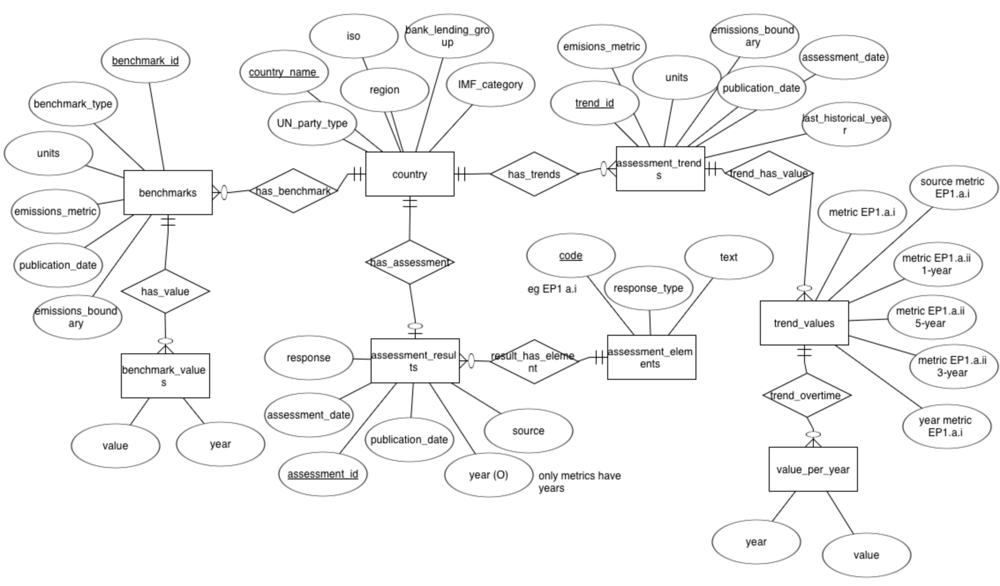
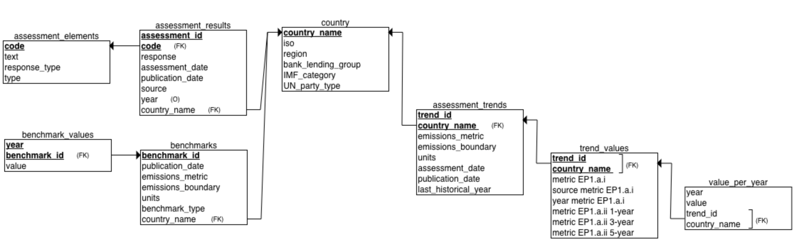
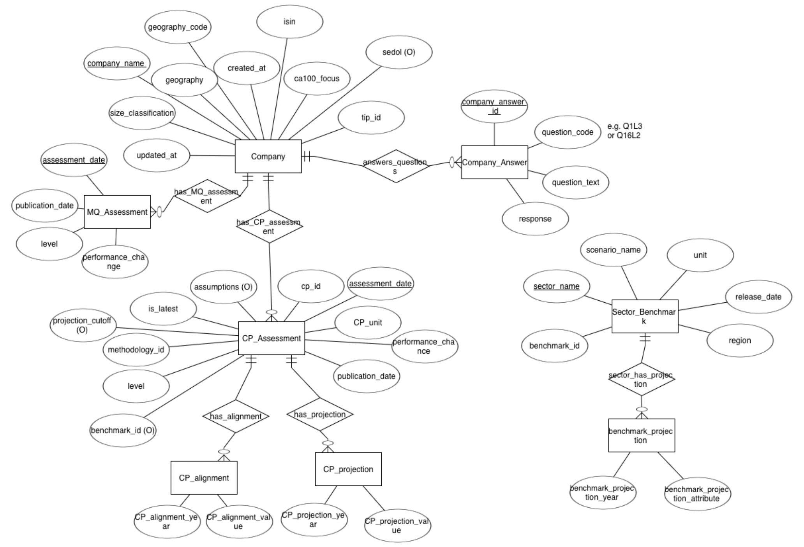
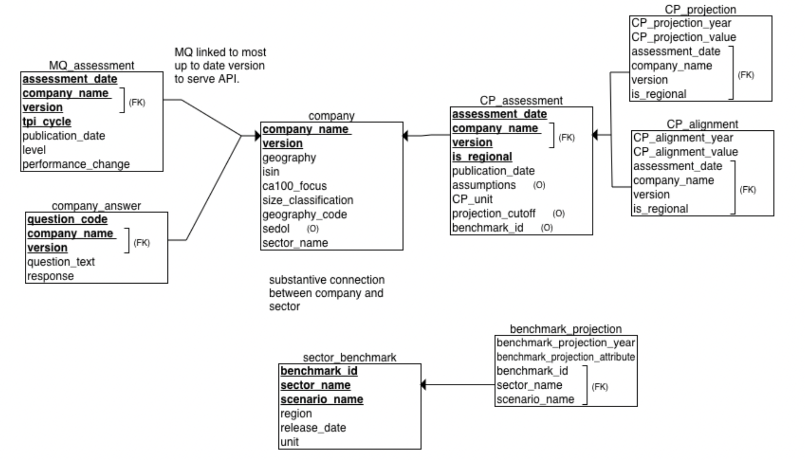

# TPI Assessment API - Data Architecture: Technical Report
AUTHORS: Maddox Leigh, Dylan Butcher, Alex Faith, Bilal Hashim

DATE: 28/05/25

__AI Usage Notice__: To aid with enhancing the writing + structuring of our report, we utilised ChatGPT in places to create the final reported documentation. To clarify, ChatGPT was not used for any of the idea generation process, instead the most common way we utilised it was to refine the grammar and flow of ideas, by prompting it with detailed bullet points of ideas which had been drafted independently by each member of the group for their relevant sections.

# 1. Introduction

The broad aims of our data architecture project was to transform a legacy data workflow, which was previously reliant on hardcoded Excel file access, into a more modern, scalable, and future-proof workflow. Our project provides a holistic rescoping of how the TPI and ASCOR data is stored, validated, and served by building a structured SQL database and a modular FastAPI backend. One of our primary objectives was to design a pipeline that could seamlessly ingest new datasets as they arrive, dynamically discover and categorise files, and serve validated outputs through a clean API interface. In line with our brief, our main goals were to ensure that our work remained auditable, and robust to future changes in file structures or assessment methodologies, whilst also critically   being clear and maintainable for any future students, partners and collaborators. Our group therefore emphasised clarity in system design, reusability of components, and a balanced and robust documentation process in order to fully capture both our implemented solutions and discarded alternatives to reflect our full design process.

Our main changes/contributions to the API architecture are as follows:

* Dynamic file discovery using glob and pattern matching,
* Structured SQL database ingestion pipelines with clear validation rules,
* Modular FastAPI endpoints for clean separation of concerns, 
* Thorough documentation and unit testing for maintainability and auditability.

As part of our reshaping of the ingestion, validation and servicing logic within the API, we explored various architectural approaches and below have documented trade-offs between performance, extensibility, and usability. <BR>

This report outlines the design choices we made, including rejected alternatives, the rationale behind our decisions, the database architecture for both ASCOR and TPI data, and an evaluation of how this new setup improves flexibility, robustness, and long-term maintainability.

This report is structured as follows:
1. Introduction 
2. Dynamic File Discovery for the TPI and ASCOR Pipelines
3. SQL Database Justification
4. ASCOR Database Design
5. TPI Database Design
6. Database Pipeline System 
7. API Endpoints & Usage
8. SQL Querty Structure & Rationale
9. Unit Testing
10. Limitations 
11. Conclusions

# 2. Dynamic File Discovery for TPI and ASCOR Pipelines

## 2A: Overview

The TPI and ASCOR pipelines have been enhanced with dynamic file discovery capabilities, making them more flexible and robust when dealing with different data directory structures and file naming conventions.

## 2B: Key Improvements

### 2B.i: Automatic Directory Discovery

**Before:**
- Hardcoded directory paths: `'TPI_sector_data_All_sectors_08032025'`
- Required exact directory names to match

**After:**
- Dynamic discovery based on patterns: directories containing `'sector_data'` or `'ascor'`
- Automatic date extraction and selection of the latest directory
- Support for multiple date formats: `DDMMYYYY`, `MMDDYYYY`, `YYYYMMDD`

### 2B.ii: Flexible File Discovery

**Before:**
- Hardcoded file names: `'Company_Latest_Assessments_5.0.csv'`
- Required exact file names to match

**After:**
- Pattern-based file discovery using glob patterns
- Automatic categorization of files by type (e.g., version 4.0 vs 5.0)
- Latest file selection when multiple files match a pattern

### 2B.iii: Centralized Utility Functions

Created `utils/file_discovery.py` with reusable functions:

- `find_latest_directory()`: Find latest directory by date pattern
- `find_latest_file()`: Find latest file by date pattern
- `find_files_by_pattern()`: Find multiple files using pattern dictionary
- `find_methodology_files()`: Specialized function for MQ methodology files
- `categorize_files()`: Categorize files based on keywords
- `extract_date_from_name()`: Extract dates from filenames/directory names

## 2C: Usage Examples

### 2C.i: TPI Pipeline

```python
# Automatically finds latest TPI directory
pipeline = TPIPipeline('data', logger)

# Discovers files dynamically:
# - Company_Latest_Assessments*.csv files (categorized by version)
# - MQ_Assessments*.csv files (sorted by methodology number)
# - CP_Assessments*.csv files (categorized as regional/standard)
# - Sector_Benchmarks*.csv files (latest by date)
```

### 2C.ii: ASCOR Pipeline

```python
# Automatically finds latest ASCOR directory
pipeline = ASCORPipeline('data', logger)

# Discovers files dynamically:
# - ASCOR_countries.*
# - ASCOR_benchmarks.*
# - ASCOR_indicators.*
# - ASCOR_assessments_results.*
# - ASCOR_assessments_results_trends_pathways.*
```

## 2D: Supported Patterns

### 2D.i: Directory Patterns
- TPI: Any directory containing `'sector_data'` (case insensitive)
- ASCOR: Any directory containing `'ascor'` (case insensitive)

### 2D.ii:Date Formats
- `DDMMYYYY` (e.g., 08032025 = March 8, 2025)
- `MMDDYYYY` (e.g., 03082025 = March 8, 2025)
- `YYYYMMDD` (e.g., 20250308 = March 8, 2025)

### 2D.iii: File Categorization
- **Company Assessments**: Categorized by version (4.0, 5.0) based on filename
- **MQ Assessments**: Sorted by methodology number extracted from filename
- **CP Assessments**: Categorized as 'regional' or 'standard' based on keywords

## 2E: Benefits

1. **Flexibility**: Works with different data directory structures and dates
2. **Robustness**: Graceful fallback to lexicographic sorting if date parsing fails
3. **Maintainability**: Centralized file discovery logic reduces code duplication
4. **Logging**: Comprehensive logging of file discovery decisions
5. **Future-proof**: Easy to add new file patterns and discovery rules

## 2F: Migration

The changes are backward compatible. Existing data directories and file structures will continue to work, but the pipelines will now also work with:

- New data directories with different dates
- Files with different naming conventions (as long as they match the patterns)
- Multiple versions of the same file type

## 2G: Error Handling

The system provides clear error messages when:
- No matching directories are found
- Required files are missing
- Date parsing fails (with fallback to name-based sorting)

All errors include context about what was being searched for and where. 

# 3. SQL Database Justification 

This section is the justification and explanation of the ASCOR and TPI databases.

## 3A: Future-Proofing Considerations when Modelling Databases

A core pillar of the data architecture across both the ASCOR and TPI databases was the intentional design for future extensibility. Every design decision was guided by considering future data expansion. The following strategies were implemented across the **ASCOR** and **TPI** databases to promote future data expansion. 

1. After inspecting the data files, we noticed that flat files often stored data in wide format (e.g., one column per year or per question). Rather than hardcoding these into rigid table columns, such structures were **normalized into long format**. This decision was made in: benchmark_values, value_per_year, cp_projection, and cp_alignment
Where each row represents a (year, value) pair or (year, alignment) pair. This is really important as it means adding new years requires no schema changes and the API  can retrieve dynamic time series data without querying changing column names.

2. In the TPI datasets, company assessments exist across multiple research cycles (e.g., MQ cycle 1–5) and assessment versions (e.g., v4.0, v5.0). Therefore, the **database tracks company version** explicitly via a composite key and uses the latest version to link to the other tables. Currently, as 5.0 is the most recent version, all the entities are linked on this to serve the API with the most up to date information. This is important for the future as outdated versions are still stored, but not used to serve the API. 

3. In both databases, each type of assessment, such as metric or company questionnare answers are **stored in their own logically isolated table**. This means new questions or codes used to assess countries or companies can be added easily, such as new ASCOR codes like EP.1.a.i. 

4. After inspecting the datasets we realised there was a lot of missing data. Therefore, **all non-key attributes were made nullable**, allowing incomplete rows of data to still be stored. This prevents data loss and ensures that as countries or companies disclose more information in future, their records can be incrementally updated without full overwrites.

# 4: ASCOR_API Database 

The **ascor_api** database is used to store the files from the *data/TPI_ASCOR_data_13012025* folder in the *TPI_API* repository. 

### 4A: ERD Diagram



#### 4B: Relationships Constraints

Here in the modelling stage, I chose to use optional relationships in cases where the presence of related data could not be guaranteed. For example, not every country in the ASCOR dataset currently has benchmark or trend. By allowing these relationships to be optional, the schema remains flexible which is important for future data expansion, allowing countries to be incrementally updated as more information becomes available.

***HAS_BENCHMARK:*** Each country can optionally have benchmark and each country cna have many benchmarks. Each benchmark must be connect to one country maximum. 

***HAS_VALUE:*** Each benchmark value (this is a pair of value and year) is linked to exactly one benchmark. Each benchmark can optionally have a benchmark value (this accounts for missing data) and can also have many benchmark values, most countries have years 2023-2030.

***HAS_ASSESSMENT:*** Each assessment is linked to exactly one country and each country can optionally have an assessment (avoiding rigid schema assumptions here) and can have maximum one assessment according to the file.

***RESULT_HAS_ELEMENT:*** Each assessment result (e.g metric) has exactly one assessment element (e.g. EP.1.a.i). Each assessment element can have multiple assessment results, for example the assessment element EP.1.a.i is used many times for each country.

***HAS_TRENDS:*** Each country can optionally have trends recorded and can also have multiple trends recorded, such as for different emmissions metrics. Each trend recorded is linked to exactly one country.

***TREND_HAS_VALUE:*** Each trend often has multiple values and each trend value must be linked to exactly one assessment trend.

***VALUES_PER_YEAR:*** Each trend value has multiple values per year, recorded from 2005 to 2030 for most countries. Each trend value pair (such as 29.88 for 2007) musyt be linked to exactly one trend value.

### 4C: Relational Schema 



### Overview of Structure and Design Choices

The following is an overview of the design choices made in response the the ASCOR data structure to ensure completeness, normalization, extensibility and a future proofed design.

First, **all non primary and foriegn key attributes were made nullable** as the ASCOR data files contains frequent missing entries (e.g., countries with partial trend data, missing source URLs). Allowing null values for all attributes was important as it meant partial values for some country assessments would not prevent this row being added to the database. This is especially important for a strong future-proof foundation to ensure all new data gets added to the database despite missingness.

Second, the **'No data' values in rows were turned into NULL values** so that the columns could be normalised into the correct data type. For example, the column *metric_ep1_a_i* in the ASCOR trends file held integer values, however the 'No data' entries prevented this being treated as the correct data type. 

Third, **primary and foreign keys were chosen based on identifiers that were consistently present** across files and are unlikely to change in future data releases, making them ideal anchors for long-term consistency. Such as benchmark_id, assessment_id, and country_name.

Fourth, in consideration of future data, the **schema avoids rigid design choices**. For example, assessment_elements allows for the addition of new assessment codes; value_per_year supports emissions trajectories through 2030 and beyond; trend_values can be expanded with new metrics as ASCOR's methodology evolves.


### 4D: Entities and Attributes 

#### 4D.i: Benchmarks

This entity stores data from the **ASCOR_benchmarks.xlsx** file. This file uses the id column in the excel file as the PK as this is unique for every country and country could not be used as there was multiple benchmarks for each country. All attributes are nullable to ensure that missing data does not prevent data being added. The logic for the initial benchmark entity is straightforward, as the attributes directly link to the names of the columns in the files and each country can have multiple benchmarks, uniquely defined by a combination of benchmark_id and country_name.

**Data types:**
```
benchmark_id         INT NOT NULL (PK)  
publication_date     DATE 
emissions_metric     VARCHAR 
emissions_boundary   VARCHAR 
units                VARCHAR
benchmark_type       VARCHAR 
country_name         VARCHAR NOT NULL (FK to country.country_name)  
```

**Example benchmark entity:**
```
benchmark_id         96  
country_name         Angola  
publication_date     2024-11-01  
emissions_metric     Absolute  
emissions_boundary   Production - excluding LULUCF  
units                MtCO₂e  
benchmark_type       National 1.5C benchmark  
```

##### 4D.ii:benchmark_values

This entity holds the year/value pairs for each country benchmark. Instead of using a wide format, where the benchmarks table would include separate columns for each year (e.g., 2023, 2024, ..., 2030), a separate normalized table (benchmark_values) is used. This is advantageous because: 
- It supports flexibility as future years can be added without altering the table schema.
- It also avoids sparse data as  years with no values aren't stored as empty columns.
- It maintains relational integrity and reduces redundancy by linking to the benchmarks table.

Moreover, to accurately model this one-to-many relationship, where each benchmark can have one value per year, the benchmark_values table uses a composite primary key on (benchmark_id, year).

The year attribute is derived from the column name in the original Excel file and must not be null, as it's logically impossible for a benchmark value to lack a corresponding year. Moreover, the value must also not be null.

**Data Types:**
```
benchmark_id         INT NOT NULL (PK part, FK to benchmarks.benchmark_id)  
year                 INT NOT NULL (PK part)  
value                FLOAT NOT NULL  
```

**Example Entry:**
```
benchmark_id         96
year                 2025
value                20.09  
```
#### 4D.iii:country 

The country entities are used to store data in the **ASCOR_countries.xlsx** file. Here, each country has one entry, therefore country was used as the PK. An alternative approach would have been to create a composite primary key between the country name and the id (first column), however, after further inspection of the data I realised these ids were not consistent across file. Therefore, introducing id as a composite primary key would have been inefficient for joining tables together, given the ids across files for countries do not match up. 

Once again, all attributes can be null, apart from the PK, to ensure missing data does not result in country not being added to the dataset.

**Data Types:**
```
country_name         VARCHAR NOT NULL (PK)  
iso                  VARCHAR  
region               VARCHAR
bank_lending_group   VARCHAR 
IMF_category         VARCHAR 
UN_party_type        VARCHAR 
```
**Example county entity:**
```
country_name         Angola  
iso                  AGO  
region               Sub-Saharan Africa  
bank_lending_group   Lower-middle-income  
IMF_category         Emerging market economies  
UN_party_type        Non-Annex I and Non-Annex II  
```

#### 4D.iv: assessment_results 

This entity stores data from the **ASCOR_assessments_results.xlsx** file. Each row in this file represents one response to one element (e.g EP.1.a or r EP.2.d) by one country, and is uniquely identified by a composite primary key of (assessment_id, code). Here the code refers the the response element and further information on each code can be found by joining this entity with assessment_elements based on the code. The assessment_id is a unique identifier for each full country assessment. However, because one assessment includes multiple element responses (each tagged by a code), a composite key is necessary. 

How **Source** and **Year** are extracted:
- In the original Excel file, each column contains year and response in the following structure *year indicator EP.1.a* and *source indicator EP.1.a*
- The year is extracted from the respective year XXX column (e.g., year indicator EP.1.a) only if present and not null.
- The source is taken from the matching source XXX column (e.g., source indicator EP.1.a) if available.

This structure allows the model to support:

- Multiple assessments per country (over time).
- Multiple responses per assessment.
- Linkage to both the indicator and country context via foreign keys.
- The year and source fields are optional but included when available, to give further metadata about the timing and provenance of the response.

Once again, null values are permitted in non-key attributes to allow for incomplete submissions or ongoing data collection.

**Data Types:**
```
assessment_id        INT NOT NULL (PK part)  
code                 VARCHAR NOT NULL (PK part, FK to assessment_elements.code)  
country_name         VARCHAR NOT NULL (FK to country.country_name)  
response             VARCHAR  
assessment_date      DATE  
publication_date     DATE  
source               VARCHAR  
year                 INT  
```

**Entry Example:**
```
assessment_id        235  
code                 EP.1.a  
country_name         Angola  
response             Yes  
assessment_date      2024-10-15  
publication_date     2024-12-01  
source               https://1p5ndc-pathways.climateanalytics.org/
year                 2023  
```
#### 4D.v:assessment_elements

This entity stores metadata from the **ASCOR_indicators.xlsx file**, defining each individual indicator, area, or metric used in ASCOR assessments. Each entry corresponds to a unique assessment element and is identified by a code, such as EP.1.a, which acts as the primary key. This table serves as a reference for interpreting codes in the assessment_results entity and enables consistent definitions for each element used across assessments. This also means future codes can be easily added in the future. 

**Data Types:**
```
code                 VARCHAR NOT NULL (PK)  
text                 VARCHAR 
response_type        VARCHAR 
type                 VARCHAR 
```

**Example assessment_elements entity:**
```
code                 EP.1.a  
text                 Has the country improved its emissions profile over the past 5 years?
response_type        Yes/No  
type                 indicator  
```

### 4E: Assessment Trends 

The Excel file **ASCOR_assessments_results_trends_pathways.xlsx** contains a mix of structurally different data types:  trend metadata, single-value metrics, and yearly time series projections. These are all stored into a single flat file. Following the best practices in relational database design (especially normalization and separation of concerns), the data was split into three distinct but related entities described below.

#### 4E.i: assessment_trends 

This entity stores data from the **ASCOR_assessments_results_trends_pathways.xlsx** file. This table stores general metadata about each emissions trend and each record corresponds to one emissions trend assessment (row in the file). A composite primary key on (trend_id, country_name) is used because the id column alone is reused across countries and their are multiple rows for each country. 

**Data Type:**
```
trend_id             INT NOT NULL (PK part)  
country_name         VARCHAR NOT NULL (PK part, FK to country.country_name)  
emissions_metric     VARCHAR  
emissions_boundary   VARCHAR  
units                VARCHAR  
assessment_date      DATE  
publication_date     DATE  
last_historical_year INT  
```
**Example Entry:**
```
trend_id             291  
country_name         Australia  
emissions_metric     Intensity per GDP-PPP  
emissions_boundary   Production - excluding LULUCF  
units                tCO₂e/Million US$  
assessment_date      2023-10-31  
publication_date     2023-12-01  
last_historical_year 2022  
```

##### 4E.ii: trend_values 

This entity stores specific metrics and performance change summaries of the assessment trends.

To organize this data:

- Metric values such as metric_ep1.a.i are cleaned (e.g., converting "No data" to NULL).
- Change values (e.g., metric_ep1.a.ii_1-year) originally included percent signs or the string "Not applicable" and are cleaned into a consistent format (as strings or nulls).

The same composite key (trend_id, country_name) is used, and a foreign key constraint links it to assessment_trends.

**Data Types:**
```
trend_id                 INT NOT NULL (PK part, FK to assessment_trends.trend_id)  
country_name             VARCHAR NOT NULL (PK part, FK to assessment_trends.country_name)  
metric_ep1_a_i           FLOAT  
source_metric_ep1_a_i    VARCHAR  
year_metric_ep1_a_i      INT  
metric_ep1_a_ii_1_year   VARCHAR  
metric_ep1_a_ii_3_year   VARCHAR  
metric_ep1_a_ii_5_year   VARCHAR  
```

**Example Entry:**
```
trend_id                 291  
country_name             Australia  
metric_ep1_a_i           328.04  
source_metric_ep1_a_i    NULL  
year_metric_ep1_a_i      NULL  
metric_ep1_a_ii_1_year   -11.20  
metric_ep1_a_ii_3_year   -8.20  
metric_ep1_a_ii_5_year   -7.00  
```

##### 4E.iii: values_per_year

This entity stores the projected emissions values for each year for each country and trend. In the raw Excel data, these values were stored as separate columns for each year, in a wide format, but to improve flexibility and reduce redundancy, these columns are normalized into a long format. This normalization allows easy updates as future years are added and cleaner handling of missing data as missing data not stored.

The foreign key (trend_id, country_name) references the trend_values table to maintain relational consistency.

**Data Types:**
```
year                    INT NOT NULL  
value                   FLOAT NOT NULL  
trend_id                INT NOT NULL (FK to trend_values.trend_id)  
country_name            VARCHAR NOT NULL (FK to trend_values.country_name)  
```

**Example Entry:**
```
year        2005  
value       805.91  
trend_id    291  
country_name Australia  
```

# 5. TPI_API Database 


### 5A: ERD Diagram




#### 5B: Relationships Constraints

***has_MQ_assessment:***  Each company can optionally have an MQ assessment or it can have multiple depending on the research cycle, as there are 5 MQ files in the TPI data folder. Each MQ assessment must be linked to exactly one company.

***has_CP_assessment:*** Each company can optionally have an CP assessment or it can have multiple (this accounts for future CP assessments). Each CP assessment must be linked to exactly one company. 

***has_projection:***  Each CP assessment can optionally have a projection or it can have many (most likely) as there are columns 2013-2050 in the file. Each projection must be linked to exactly one CP assessment.

***has_alignment:*** Each CP assessment can optionally have a alignment (missing data) or it can have many (most likely) as there are columns Carbon Performance Alignment 2035 and Carbon Performance Alignment 2050 etc. in the file. Each alignment must be linked to exactly one CP assessment.

***answers_questions:***  Each company can optionally answer a question or answer multiple, but each question must be linked to exactly one company.

***sector_has_projection:***   Each sector can optionally have a projection (this accounts for missing data) or can have many, specifically years 2013-2050 in the file. Each sector must be linked to exactly one sector.


### 5C: Relational Schema 



### 5D: Overview of TPI Structure and Design Choices

The following is an overview of the major design decisions made when building the TPI database schema. 

Most importantly, the **schema are linked on the most recent version of *Company lastest assessment files***. In the TPI file there are two different versions of company assessments, 4.0 and 5.0. Therefore, companies are stored with a version field (e.g., 4.0 or 5.0), and all dependent tables (e.g., company_answer, mq_assessment, cp_assessment) use composite primary keys that include both company_name and version. Currently, as 5.0 is the most recent version, all the entities are linked on this to serve the API with the most up to date information. This is important for the future as outdated versions are still stored, but not used to serve the API. 

Secondly, **company and sector are not linked**. Although both the company and sector benchmark datasets contain a "sector" field, they cannot be directly linked due to a mismatch in how sector names are defined. For example, 13 sectors in the company dataset (e.g., Telecommunications, Oil & Gas Distribution, Consumer Services) do not exist in the sector benchmark data. Moreover, even for those that match, the benchmark file contains multiple entries for the same sector. So even when a company is listed in the Airlines sector, it's unclear which of the many benchmark rows it should be linked to. 

### 5E: Entities and Attributes 

#### 5E.i: company

This entity stores metadata about each assessed company from the **Company_Latest_Assessments_4.0.csv** and **Company_Latest_Assessments_5.0.csv** files. Each company version is included as an attribute, which is derived from the file names A composite primary key of company_name and version is used to identify each company in a specific assessment cycle.

As noted in the previous section, the *sector_name* field here is not linkable to the sector benchmark data, since it contains non-standard labels like Basic Materials or Technology that do not correspond to benchmark sectors.

The same as the ASCOR dataset, all non-key attributes are nullable to allow for partial submissions or missing metadata.

**Data Types:**
```
company_name         VARCHAR NOT NULL (PK part)  
version              VARCHAR NOT NULL (PK part)  
geography            VARCHAR  
isin                 VARCHAR  
ca100_focus          VARCHAR  
size_classification  VARCHAR  
geography_code       VARCHAR  
sedol                VARCHAR  
sector_name          VARCHAR  
```

**Example Entities:**
```
company_name         Shell plc  
version              5.0  
geography            United Kingdom  
isin                 GB00B03MLX29  
ca100_focus          Yes  
size_classification  Large  
geography_code       GBR  
sedol                B03MLX2  
sector_name          Oil & Gas (Other)  
```


#### 5E.ii:sector_benchmark

This entity stores emissions benchmarks from the **Sector_Benchmarks_08032025.csv file**. These benchmarks define emissions intensity or absolute targets under different climate scenarios (e.g., Below 2 Degrees, Net Zero 2050).

The composite key (benchmark_id, sector_name, scenario_name) uniquely identifies each benchmark. This allows the schema to distinguish between multiple benchmarks for the same sector depending on the scenario and region.

**Data Types:**
```
benchmark_id         VARCHAR NOT NULL (PK part)  
sector_name          VARCHAR NOT NULL (PK part)  
scenario_name        VARCHAR NOT NULL (PK part)  
region               VARCHAR   
release_date         DATE   
unit                 VARCHAR
```

**Example Entity:**
```
benchmark_id         B2025  
sector_name          Cement  
scenario_name        Net Zero 2050  
region               Global  
release_date         2025-03-08  
unit                 tCO₂e/tonne  
```

#### 5E.iii: benchmark_projections 

This entity stores yearly emissions benchmarks for each sector-scenario combination. The raw Excel format contained one column per year (2013–2050) so these were normalized into a long format with one row per year per benchmark. Moreover, each projection is linked back to its parent benchmark via a foreign key on (benchmark_id, sector_name, scenario_name). This makes it easy if more years are added in the future.


**Data Types:**
```
benchmark_projection_year        INT 
benchmark_projection_attribute   FLOAT  
benchmark_id                     VARCHAR NOT NULL (FK part)  
sector_name                      VARCHAR NOT NULL (FK part)  
scenario_name                    VARCHAR NOT NULL (FK part)  

```

**Example Entity:**
```
benchmark_projection_year        2025  
benchmark_projection_attribute   0.89  
benchmark_id                     B2025  
sector_name                      Cement  
scenario_name                    Net Zero 2050  
```


#### 5.iv:company_answers

This entity stores responses to TPI’s questionnaire for each company and assessment cycle from the files **Company_Latest_Assessments_4.0.csv** and **Company_Latest_Assessments_5.0.csv**.

In these files, each question appears as a separate column, where the header combines a unique question code and descriptive text in the following format *Q4L2 | Has the company set greenhouse gas emission reduction targets?*.

**To convert this into a normalized database structure the following steps are taken:**
1. Each column starting with "Q" and containing a "|" is interpreted as a question.
2. The question code and question text are extracted by splitting on the pipe character.
3. For every company, each response is transformed into a single row with its associated code, text, and version.
4. Responses that were empty or missing were excluded to maintain integrity under the NOT NULL constraint.

Rather than embedding all 14+ questions directly in the company table, having a seperate table for company answers avoids schema rigidity as new questions are introduced and reduces sparsity. The structure uses a composite primary key of (question_code, company_name, version) to uniquely identify each response and ensure consistency with the versioned company table via foreign key constraints.

**Data Types:**
```
question_code       VARCHAR NOT NULL (PK part)  
question_text       VARCHAR NOT NULL  
response            VARCHAR NOT NULL  
company_name        VARCHAR NOT NULL (FK part)  
version             VARCHAR NOT NULL (FK part)  

```

**Example Entity:**
```
question_code        Q4L2  
question_text        Has the company set greenhouse gas emission reduction targets?  
response             No  
company_name         Yankuang Energy  
version              4.0  
```


#### 5E.v: MQ_assessments

This entity stored the MQ assessment data from the *** MQ_Assessments_Methodology_<n>_....csv***, where <n> represents the TPI research cycle. Each cycle corresponds to a specific window of assessment activity e.g. cycle 1 assessments in 2015–2017 and were published 2017–2018. Here, the **tpi_cycle**  attribute is extracted directly from the filename. For example:

- MQ_Assessments_Methodology_1_...csv → tpi_cycle = 1
- MQ_Assessments_Methodology_4_...csv → tpi_cycle = 4 

Each MQ assessment entry is joined to the latest version of the company (based on a subquery), ensuring the record links to the correct company_name and version.

**Data Types:**
```
assessment_date      DATE NOT NULL (PK part)  
publication_date     DATE  
level                INT  
performance_change   VARCHAR  
tpi_cycle            INT NOT NULL (PK part)  
company_name         VARCHAR NOT NULL (PK part, FK to company.company_name)  
version              VARCHAR NOT NULL (PK part, FK to company.version)  
```

**Example Entity:**
```
assessment_date       2017-01-10  
publication_date      2017-07-01  
level                 1  
performance_change    new  
tpi_cycle             1  
company_name          Yankuang Energy  
version               4.0  
```


#### 5E.vi: CP_assessment 

This entity stores CP assessment data from **CP_Assessments_08032025.csv**, which is global assessments, and **CP_Assessments_Regional_08032025.csv**, which is for regional assessments.

The attributed **is_regional** is introduced to distinguish the two datasets (0 = global, 1 = regional), meaning that regional and global assessments  can be distinguished while still using one unified schema. A composite primary key of (assessment_date, is_regional, company_name, version) is used to uniquely identify each assessment event per company and context.

**Data Types:**
```
assessment_date       DATE NOT NULL (PK part)  
publication_date      DATE  
assumptions           VARCHAR  
cp_unit               VARCHAR  
projection_cutoff     DATE  
benchmark_id          VARCHAR  
is_regional           VARCHAR NOT NULL (PK part)  
company_name          VARCHAR NOT NULL (PK part)  
version               VARCHAR NOT NULL (PK part)  
```

**Example Entity:**
```
assessment_date       2023-10-15  
publication_date      2023-12-01  
assumptions           IEA Net Zero by 2050 scenario  
cp_unit               tCO₂e/MWh  
projection_cutoff     2022-12-31  
benchmark_id          B2025  
is_regional           0  
company_name          Shell plc  
version               5.0  

```

#### 5E.vii: CP_projection

This entity contains the emissions projection values for the CP assessments. In the original files, these projections were stored with one column per year (e.g., 2022, 2023, ..., 2050). Similar to **values_per_year** in the ASCOR database, to improve flexibility and reduce redundancy, these columns are normalized into a long format.

The year attribute is derived from the column name in the original Excel file and must not be null and the value must also not be null. 

**Data Types:**
```
cp_projection_year      INT NOT NULL  
cp_projection_value     INT NOT NULL  
assessment_date         DATE NOT NULL (FK part)  
company_name            VARCHAR NOT NULL (FK part)  
version                 VARCHAR NOT NULL (FK part)  
is_regional             VARCHAR NOT NULL (FK part)  

```

**Example Entity:**
```
cp_projection_year      2025  
cp_projection_value     183  
assessment_date         2023-10-15  
company_name            Shell plc  
version                 5.0  
is_regional             0  
```

#### 5E.viii: CP_alignment 

This entity stores  alignment scores from the CP assessments. In the raw files, each column is titled in the format: *Carbon Performance Alignment 2025, ... 2030, ... 2050, etc*.

**To normalize this:**
1. All columns that start with "Carbon Performance Alignment " are selected.
2. The target year is extracted by parsing the final part of the column name (e.g., "2030" from "Carbon Performance Alignment 2030").
3. For each row (i.e., each company assessment), the value under that column is treated as the alignment result (e.g., "Aligned", "Not Aligned", "No Disclosure").
4. Each year/value pair becomes a new row in the cp_alignment table, along with company metadata (name, version, assessment date, and regional/global flag).
5. Any rows with null or missing alignment values are excluded, ensuring the table only stores meaningful entries.

Storing this alignment data in a seperate table allows for flexiable querying and future proofing if new years are added


**Data Types:**
```
cp_alignment_year      INT NOT NULL  
cp_alignment_value     VARCHAR NOT NULL  
assessment_date        DATE NOT NULL (FK part)  
company_name           VARCHAR NOT NULL (FK part)  
version                VARCHAR NOT NULL (FK part)  
is_regional            VARCHAR NOT NULL (FK part)  

```

**Example Entity:**
```
cp_alignment_year      2030  
cp_alignment_value     Not Aligned  
assessment_date        2023-10-15  
company_name           Shell plc  
version                5.0  
is_regional            0  

```
# 6. Database Pipeline System 

## 6A: Overview

This system provides a structured way to process and load data into TPI and ASCOR databases using an object-oriented approach. The pipeline handles data ingestion, validation, and database population while maintaining a comprehensive audit trail.

## 6B: System Architecture

### 6B.i: Directory Structure

```
pipelines/
├── __init__.py
├── base_pipeline.py      # Abstract base class defining common pipeline functionality
├── tpi_pipeline.py       # TPI-specific pipeline implementation
└── ascor_pipeline.py     # ASCOR-specific pipeline implementation
```

### 6B.ii: Pipeline Flow

1. **Initialisation**
   - Database connection setup
   - Logger configuration
   - Data validator initialization

2. **Table Management**
   - Drop existing tables (except audit_logs)
   - Create new tables with proper schemas
   - Log pipeline start

3. **Data Processing**
   - Read source files
   - Transform data into appropriate formats
   - Store processed data in memory

4. **Data Validation**
   - Validate data structure and content
   - Check for required fields
   - Verify data types and relationships
   - Generate validation report

5. **Database Population**
   - Insert validated data into tables
   - Maintain referential integrity
   - Log successful insertions

6. **Audit Trail**
   - Log pipeline execution details
   - Record validation results
   - Track source files and row counts

## 6C: Data Validation

The pipeline validates data at multiple levels:

### 6C.i: Validation Process
1. **Pre-insertion Checks**
   - Validates all data before database operations
   - Blocks insertion if critical errors exist
   - Allows warnings to proceed with notification

2. **Validation Types**
   - Schema validation (required fields, data types)
   - Format validation (version numbers, ISO codes, dates)
   - Data integrity (duplicates, null values)
   - Basic business rules:
     - TPI cycle values (1-5)
     - Year ranges (2000-2100)
     - Version format (x.x)
     - ISO code format (2-3 letters)

3. **Validation Results**
   All validation results are logged to the audit_log table with:
   - Status: PASSED/WARNINGS/FAILED
   - Error/warning messages
   - Affected rows
   - Validation rules checked

## 6D: SQLAlchemy Models

The pipeline uses SQLAlchemy models to define the database schema and relationships. Each model represents a table in either the TPI or ASCOR database.

### 6D.i: ASCOR Models

#### 6D.i.1: Country
- **Purpose**: Stores country-level information and metadata
- **Key Fields**:
  - `country_name` (String, PK): Unique identifier for the country
  - `iso` (String): ISO country code (2-3 letters)
  - `region` (String): Geographic region classification
  - `bank_lending_group` (String): World Bank classification
  - `imf_category` (String): IMF classification
  - `un_party_type` (String): UNFCCC party type
- **Relationships**:
  - One-to-many with `Benchmark`
  - One-to-many with `AssessmentResult`
  - One-to-many with `AssessmentTrend`
- **Validation Rules**:
  - ISO code must be 2-3 letters
  - Country name is required and unique

#### 6D.i.2: AssessmentElement
- **Purpose**: Defines assessment questions, criteria, and response types
- **Key Fields**:
  - `code` (String, PK): Unique element code (alphanumeric with dots)
  - `text` (String): Question or assessment text
  - `response_type` (String): Expected response format
  - `type` (String): Element classification
- **Relationships**:
  - One-to-many with `AssessmentResult`
- **Validation Rules**:
  - Code must be alphanumeric with dots
  - All fields are required

#### 6D.i.3: AssessmentResult
- **Purpose**: Stores country assessment responses and metadata
- **Key Fields**:
  - `assessment_id` (Integer, PK): Unique assessment identifier
  - `code` (String, FK): References AssessmentElement
  - `response` (String): Assessment response
  - `assessment_date` (Date): When assessment was conducted
  - `publication_date` (Date): When results were published
  - `source` (String): Data source
  - `year` (Integer): Assessment year
  - `country_name` (String, FK): References Country
- **Relationships**:
  - Many-to-one with `Country`
  - Many-to-one with `AssessmentElement`
- **Validation Rules**:
  - Assessment date must be valid
  - Country must exist
  - Element code must exist

#### 6D.i.4: AssessmentTrend
- **Purpose**: Tracks emissions trends and metrics for countries
- **Key Fields**:
  - `trend_id` (Integer, PK): Unique trend identifier
  - `country_name` (String, PK): References Country
  - `emissions_metric` (String): Type of emissions measurement
  - `emissions_boundary` (String): Scope of emissions
  - `units` (String): Measurement units
  - `assessment_date` (Date): When trend was assessed
  - `publication_date` (Date): When trend was published
  - `last_historical_year` (Integer): Last year of historical data
- **Relationships**:
  - Many-to-one with `Country`
  - One-to-many with `TrendValue`
  - One-to-many with `ValuePerYear`
- **Validation Rules**:
  - Country must exist
  - Years must be between 2000-2100

#### 6D.i.5: TrendValue
- **Purpose**: Stores annual values for assessment trends
- **Key Fields**:
  - `trend_id` (Integer, PK): References AssessmentTrend
  - `country_name` (String, PK): References Country
  - `year` (Integer, PK): Year of the value
  - `value` (Float): Trend value
- **Relationships**:
  - Many-to-one with `AssessmentTrend`
- **Validation Rules**:
  - Year must be between 2000-2100
  - Value must be numeric

#### 6D.i.6: ValuePerYear
- **Purpose**: Stores detailed yearly values for trends
- **Key Fields**:
  - `year` (Integer, PK): Year of the value
  - `value` (Float): Yearly value
  - `trend_id` (Integer, PK): References AssessmentTrend
  - `country_name` (String, PK): References Country
- **Relationships**:
  - Many-to-one with `AssessmentTrend`
- **Validation Rules**:
  - Year must be between 2000-2100
  - Value must be numeric

#### 6D.i.7: Benchmark
- **Purpose**: Defines emissions benchmarks and metrics
- **Key Fields**:
  - `benchmark_id` (Integer, PK): Unique benchmark identifier
  - `publication_date` (Date): When benchmark was published
  - `emissions_metric` (String): Type of emissions measurement
  - `emissions_boundary` (String): Scope of emissions
  - `units` (String): Measurement units
  - `benchmark_type` (String): Classification of benchmark
  - `country_name` (String, FK): References Country
- **Relationships**:
  - Many-to-one with `Country`
  - One-to-many with `BenchmarkValue`
- **Validation Rules**:
  - Publication date must be valid
  - Country must exist if specified

#### 6D.i.8: BenchmarkValue
- **Purpose**: Stores annual values for benchmarks
- **Key Fields**:
  - `year` (Integer, PK): Year of the value
  - `benchmark_id` (Integer, PK): References Benchmark
  - `value` (Float): Benchmark value
- **Relationships**:
  - Many-to-one with `Benchmark`
- **Validation Rules**:
  - Year must be between 2000-2100
  - Value must be numeric

### 6D.ii: TPI Models

#### 6D.ii.1: Company
- **Purpose**: Stores company information and metadata
- **Key Fields**:
  - `company_name` (String, PK): Company identifier
  - `version` (String, PK): Data version (x.x format)
  - `geography` (String): Company location
  - `isin` (String): ISIN identifier
  - `ca100_focus` (String): Climate Action 100+ focus
  - `size_classification` (String): Company size category
  - `geography_code` (String): Geographic code
  - `sedol` (String): SEDOL identifier
  - `sector_name` (String): Industry sector
- **Relationships**:
  - One-to-many with `CompanyAnswer`
  - One-to-many with `MQAssessment`
  - One-to-many with `CPAssessment`
- **Validation Rules**:
  - Version must be in x.x format
  - Company name and version combination must be unique

#### 6D.ii.2: CompanyAnswer
- **Purpose**: Stores company questionnaire responses
- **Key Fields**:
  - `question_code` (String, PK): References question
  - `company_name` (String, PK): References Company
  - `version` (String, PK): Data version
  - `question_text` (String): Question text
  - `response` (String): Company's response
- **Relationships**:
  - Many-to-one with `Company`
- **Validation Rules**:
  - Question code must be alphanumeric
  - Company must exist
  - Version must match company version

#### 6D.ii.3: MQAssessment
- **Purpose**: Stores Management Quality assessments
- **Key Fields**:
  - `assessment_date` (Date, PK): Assessment date
  - `company_name` (String, PK): References Company
  - `version` (String, PK): Data version
  - `tpi_cycle` (Integer, PK): Assessment cycle (1-5)
  - `level` (String): Assessment level
  - `performance_change` (String): Change indicator
  - `publication_date` (Date): When assessment was published
- **Relationships**:
  - Many-to-one with `Company`
- **Validation Rules**:
  - TPI cycle must be between 1-5
  - Assessment date must be valid
  - Company must exist

#### 6D.ii.4: CPAssessment
- **Purpose**: Stores Carbon Performance assessments
- **Key Fields**:
  - `assessment_date` (Date, PK): Assessment date
  - `company_name` (String, PK): References Company
  - `version` (String, PK): Data version
  - `is_regional` (String, PK): Regional scope indicator
  - `publication_date` (Date): When assessment was published
  - `assumptions` (String): Assessment assumptions
  - `cp_unit` (String): Performance unit
  - `projection_cutoff` (Date): History to projection cutoff
  - `benchmark_id` (String): Reference benchmark
- **Relationships**:
  - Many-to-one with `Company`
  - One-to-many with `CPProjection`
  - One-to-many with `CPAlignment`
- **Validation Rules**:
  - Assessment date must be valid
  - Company must exist
  - Regional indicator must be valid

#### 6D.ii.5: CPAlignment
- **Purpose**: Stores carbon performance alignment data
- **Key Fields**:
  - `cp_alignment_year` (Integer, PK): Alignment year
  - `cp_alignment_value` (String): Alignment value
  - `assessment_date` (Date, PK): References CPAssessment
  - `company_name` (String, PK): References Company
  - `version` (String, PK): Data version
  - `is_regional` (String, PK): Regional scope indicator
- **Relationships**:
  - Many-to-one with `CPAssessment`
- **Validation Rules**:
  - Year must be between 2000-2100
  - Assessment must exist

#### 6D.ii.6: CPProjection
- **Purpose**: Stores carbon performance projections
- **Key Fields**:
  - `cp_projection_year` (Integer, PK): Projection year
  - `cp_projection_value` (Integer): Projection value
  - `assessment_date` (Date, PK): References CPAssessment
  - `company_name` (String, PK): References Company
  - `version` (String, PK): Data version
  - `is_regional` (String, PK): Regional scope indicator
- **Relationships**:
  - Many-to-one with `CPAssessment`
- **Validation Rules**:
  - Year must be between 2000-2100
  - Assessment must exist

#### 6D.ii.7: SectorBenchmark
- **Purpose**: Defines sector-specific benchmarks
- **Key Fields**:
  - `benchmark_id` (String, PK): Unique benchmark identifier
  - `sector_name` (String, PK): Industry sector
  - `scenario_name` (String, PK): Scenario identifier
  - `region` (String): Geographic region
  - `release_date` (Date): When benchmark was released
  - `unit` (String): Measurement unit
- **Relationships**:
  - One-to-many with `BenchmarkProjection`
- **Validation Rules**:
  - Release date must be valid
  - Sector name must be valid

#### 6D.ii.8: BenchmarkProjection
- **Purpose**: Stores sector benchmark projections
- **Key Fields**:
  - `benchmark_projection_year` (Integer, PK): Projection year
  - `benchmark_projection_attribute` (Float): Projection value
  - `benchmark_id` (String, PK): References SectorBenchmark
  - `sector_name` (String, PK): References SectorBenchmark
  - `scenario_name` (String, PK): References SectorBenchmark
- **Relationships**:
  - Many-to-one with `SectorBenchmark`
- **Validation Rules**:
  - Year must be between 2000-2100
  - Benchmark must exist

## 6E. Audit Trail

### 6E.i: Logging System

1. **Pipeline Execution Logs**
   - Process name and status
   - Start and end timestamps
   - Error messages and stack traces
   - Validation results

2. **Data Operation Logs**
   - Table modifications
   - Row counts
   - Source file information
   - Operation timestamps

3. **Validation Logs**
   - Validation rule results
   - Error and warning details
   - Data quality metrics

### 6E.ii: Log Storage

- **Database Table**: `audit_log`
- **Fields**:
  - `execution_id`: Unique log identifier
  - `process`: Process name
  - `status`: Execution status
  - `notes`: Additional information
  - `table_name`: Affected table
  - `source_file`: Data source
  - `rows_inserted`: Operation size
  - `timestamp`: Operation time

## 6F: Audit Logging System
Both TPI and ASCOR databases maintain an identical `audit_log` table that tracks all pipeline operations and validation results:

```sql
CREATE TABLE audit_log (
    execution_id SERIAL PRIMARY KEY,
    execution_timestamp TIMESTAMP WITH TIME ZONE DEFAULT CURRENT_TIMESTAMP,
    execution_user VARCHAR(255) DEFAULT CURRENT_USER,
    process VARCHAR(255) NOT NULL,
    execution_status VARCHAR(50) NOT NULL,
    execution_notes TEXT,
    table_name VARCHAR(255),
    source_file VARCHAR(1024),
    rows_inserted INTEGER
);
```

The audit log table serves multiple purposes:
1. **Pipeline Execution Tracking**
   - Records start and end of pipeline runs
   - Tracks data loading operations noting the table and files accessed
   - Logs any errors or failures

2. **Validation Results**
   - Records validation start and completion
   - Tracks validation status (PASSED/WARNINGS/FAILED)
   - Stores detailed validation messages and affected rows

### 6F.i: Validation Status Codes
The following status codes are used in the audit log:
- `VALIDATION_START`: Validation process begins
- `VALIDATION_PASSED`: All validation checks passed successfully
- `VALIDATION_WARNINGS`: Validation passed with warnings
- `VALIDATION_FAILED`: Validation failed with errors

## 6G: Base Pipeline Class
The `BasePipeline` class defines common methods for database operations:

### 6G.i: Key Methods
- `drop_tables()`: Drops all tables except audit_log
- `create_tables()`: Creates all necessary tables
- `populate_tables()`: Processes and loads data into tables
- `_process_data()`: Abstract method for data processing
- `_validate_data()`: Abstract method for data validation

### 6G.ii: Error Handling
The pipeline includes comprehensive error handling:
- Database connection errors
- Permission issues
- Data validation failures
- File access problems

All errors are logged to the audit_log table with detailed error messages.

## 6H: Database Models
The pipeline uses SQLAlchemy models for database operations. Key models include:

### 6H.i: TPI Models
- `Company`: Company information
- `CompanyAnswer`: Company questionnaire responses
- `MQAssessment`: Management Quality assessments
- `CPAssessment`: Carbon Performance assessments

### 6H.ii: ASCOR Models
- `Country`: Country information
- `AssessmentElement`: Assessment questions
- `AssessmentResult`: Assessment responses
- `AssessmentTrend`: Trend data


## 6I:Logging
The pipeline uses a comprehensive logging system:

### 6I.i: Log Types
1. **Pipeline Logs**
   - Execution status
   - Processing steps
   - Performance metrics

2. **Validation Logs**
   - Validation rules
   - Error messages
   - Warning details

3. **Data Quality Logs**
   - Row counts
   - Data statistics
   - Quality metrics

### 6I.ii:Log Storage
All logs are stored in the audit_log table with:
- Timestamps
- User information
- Detailed messages
- Related data metrics

# 7. API Endpoints & Usage

## 7A: Overview
The project uses a modular and structured approach built around FastAPI, a modern, efficient Python web framework designed for high performance, easy validation, and clear documentation.

At the core, we have the main application (`main.py`), which serves as the entry point. Its primary role is to initialize the FastAPI application and integrate the various route modules into a unified API. This modular architecture improves maintainability and clarity, allowing each component to handle distinct functionalities without unnecessary dependencies or complexity.

There are three main functional modules integrated into the application: 
1. **Company Routes (`company_routes.py`)**: 
  - This module manages endpoints related specifically to companies and their assessments.
  - It dynamically loads the most recent dataset available, ensuring the application consistently accesses updated information without manual intervention.
  - It provides endpoints to list companies, retrieve detailed information, historical assessment records, and compare recent performances.
2. **Management Quanlity (MQ) Routes (`mq_routes.py`)**: 
  - Dedicated specifically to Management Quality assessments, this module similarly dynamically selects and loads the latest MQ datasets.
  - It includes specialized endpoints for retrieving current MQ assessments, historical assessments filtered by methodology cycle, and sector-wide trends.
  - This design enables easy tracking and comparative analysis of MQ trends over time and across sectors.
3. **Carbon Performance (CP) Routes (`cp_routes.py`)**:
  - Focused explicitly on Carbon Performance assessments, this module consolidates multiple CP assessment files dynamically into a unified data structure.
  - It provides endpoints to fetch the latest CP assessments, detailed historical CP data for individual companies, assess alignment with future carbon reduction targets, and perform comparisons between different assessment cycles.

Central to ensuring the correctness and consistency of data across the entire API is the `schemas.py` module. This module contains Pydantic models used to validate and serialize data sent to and from the API. These models define clear and strict data structures for companies, MQ assessments, CP assessments, and various response formats, including pagination and performance comparisons. Leveraging Pydantic’s automatic data validation ensures robustness and significantly reduces errors due to data inconsistencies.

The entire setup integrates seamlessly as follows:
- Upon launching the application, the main script (`main.py`) initializes the FastAPI application.
- It integrates each of the three dedicated route modules (`company_routes.py`, `mq_routes.py`, and `cp_routes.py`) through FastAPI routers. Each router encapsulates functionality relevant to its area, ensuring clear separation of concerns.
- Requests arriving at the API are directed to the appropriate route module based on URL structure (e.g., `/company`, `/mq`, or `/cp`).
- Each route module accesses its own specialized dataset, which is dynamically selected and loaded at runtime from the most recent available data.
- Responses from these endpoints are strictly validated against defined schemas to ensure data accuracy and consistency before being returned to the user.

In essence, this structured setup ensures high reliability, maintainability, clarity, and scalability. The clear separation of modules combined with robust schema validation and dynamic data handling creates an efficient, adaptable, and user-friendly API ecosystem.

## 7B: Data Source and Format
This project uses datasets sourced from the [Transition Pathway Initiative (TPI)](https://www.transitionpathwayinitiative.org/corporates)
, specifically focusing on company assessments, Management Quality (MQ), and Carbon Performance (CP) evaluations.

The data structure is as follows: 
- **Data Source**: The datasets originate directly from the TPI's publicly available assessment data, regularly updated and organised in date-stamped directories following the naming convention: `TPI sector data - All sectors - MMDDYYYY`
- **Data Format**: The assessment files are stored as CSV files within these directories. There are three main types of CSV datasets used:
  - Company Assessments: `Company_Latest_Assessments_MMDDYYYY.csv`
    - Contains general details about each company's latest assessment, such as company name, sector, geography, latest assessment year, Management Quality (MQ) score, and Carbon Performance (CP) alignment details.
  - Management Quality (MQ) Assessments: `MQ_Assessments_Methodology_*.csv`
    - Contains detailed Management Quality assessments across multiple methodology cycles. Each record includes the MQ STAR rating, assessment dates, and sector-specific information.
  - Carbon Performance (CP) Assessments: `CP_Assessments_*.csv`
    - Contains detailed Carbon Performance evaluations, with alignment targets for different future years (2025, 2027, 2035, and 2050).
- **Automated Data Handling**: The project automatically selects the latest data folder and CSV files, extracting and processing them dynamically without manual intervention. This ensures:
  - Scalability: Data updates don't require changes in the code.
  - Robustness: Consistent handling of data formats and dates.
  - Flexibility: Easy maintenance and continuous integration with new datasets.

These structured CSV files serve as the backbone for the API, powering all endpoints and responses. The data provided by this API can be particularly valuable to sustainability researchers, policymakers, financial analysts, and corporate sustainability officers. Users might leverage this data for ESG (Environmental, Social, and Governance) reporting, investment decision-making, sector benchmarking, and evaluating corporate transitions towards low-carbon economies.

# 8. SQL Query Structure Rationale for the TPI/ASCOR API

## 8A: Introduction

This section outlines general principles and common patterns guiding the structure of SQL queries used within the TPI (Transition Pathway Initiative) and ASCOR (Assessing Sovereign Climate-related Opportunities and Risks) API. These queries, primarily located in the `sql/tpi/queries/` and `sql/ascor/queries/` directories, form the backbone of data retrieval for our analytical platform.

The overarching goal is to create SQL queries that are not only functional but also **readable, maintainable, efficient, and analytically powerful**. The guiding philosophy is to ensure deep justification for technical choices, maintain clarity in logic, and establish a clear connection between backend data processing and the insights these processes enable.

## 8B: Core SQL Structuring Principles for API Endpoints

Our SQL queries are designed with several core principles in mind to effectively serve the API endpoints and, consequently, the advanced analytical needs demonstrated in our Jupyter notebooks.

### 8B.i: Parameterization for Flexibility and Precision

- **How:** Queries are designed to be dynamic. While the `.sql` files may show placeholders (e.g., `:sector_name`, `:assessment_year`, `:limit`, `:offset`), the Python application code (in `routes/*.py` and `services.py`) injects parameters derived from API requests into these queries before execution. This is often managed by the `DatabaseManager` which uses `sqlalchemy` for safe parameter binding.
- **Justification:** This is fundamental to creating a **Complex Query Interface**. Instead of writing a unique, static query for every conceivable data slice, parameterization allows a single, well-structured query to serve a multitude of analytical requests. Users can precisely filter by company attributes, assessment years, MQ levels, sectors, geographies, etc., directly via API calls. This approach enables detailed and targeted data retrieval, moving beyond generic data dumps and facilitating more focused and structured information extraction, which is vital for effective analysis.

### 8B.ii: Common Table Expressions (CTEs) for Clarity and Modularity

- **How:** Many of our more complex analytical queries (e.g., `get_all_companies.sql`, `get_company_performance_comparison.sql`, and queries within the notebooks themselves) extensively use Common Table Expressions (`WITH ... AS (...)` clauses).
- **Justification:**
    - **Readability & Maintainability:** CTEs break down intricate logic into logical, named sub-queries. For example, one CTE might identify the latest assessments, another might calculate sector averages, and the final `SELECT` statement then joins these CTEs. This makes the query flow much easier to follow and debug compared to deeply nested subqueries or extremely long, monolithic queries. This significantly enhances the clarity of the query logic and allows for more detailed justification of each step in the data transformation process.
    - **Modularity:** CTEs can often be developed and tested independently before being combined, improving the development process.
    - **Performance (Indirectly):** While not always a direct performance boost over equivalent subqueries (PostgreSQL's optimizer is quite smart), CTEs can sometimes help the optimizer by materializing intermediate results, and they certainly help developers reason about complex logic which can lead to better overall query design.
    - **Analytical Enablement:** They allow for building up complex datasets step-by-step, essential for multi-faceted analyses like correlating MQ scores with CP data after filtering for latest versions.

### 8B.iii: Strategic JOINs for Rich Data Integration

- **How:** Queries frequently use `JOIN` clauses (`INNER JOIN`, `LEFT JOIN`) to combine data from multiple normalized tables (e.g., `company` with `mq_assessment`, `cp_assessment`, `cp_alignment`, etc.).
- **Justification:**
    - **`INNER JOIN`:** Used when the relationship is integral to the result (e.g., an `mq_assessment` record must have a corresponding `company` record).
    - **`LEFT JOIN`:** Crucial when we need all records from the "left" table and any matching records from the "right" table, including nulls if no match is found. This is vital for analyses where, for example, we want all companies in a sector, even if some don't have a CP assessment for a particular year. This ensures comprehensive data for analysis rather than inadvertently dropping records.
    - **Analytical Enablement:** The ability to correctly and efficiently join across multiple dimensions (company attributes, MQ scores, CP scores, temporal data, benchmarks) is the cornerstone of our relational database's analytical power. It allows us to synthesize a holistic view from disparate data points, directly supporting the generation of comprehensive datasets necessary for insightful data presentation.

### 8B.iv: Window Functions for Advanced In-Query Calculations

- **How:** Queries like those for temporal analysis or identifying latest records utilize SQL window functions (e.g., `ROW_NUMBER() OVER (PARTITION BY ... ORDER BY ...)` in `performance_correlation_query` within the notebook, or `LAG() OVER (...)` in `temporal_evolution_query`).
- **Justification:**
    - **Efficiency:** Window functions perform calculations across a set of table rows that are somehow related to the current row. This is done efficiently at the database level. For instance, `ROW_NUMBER()` is used to pick the latest assessment per company without complex self-joins. `LAG()` allows direct access to data from a previous row within the same partition, essential for calculating period-over-period changes.
    - **Analytical Power:** They enable sophisticated data manipulations directly in SQL that would be much more complex and less performant if implemented in application code (e.g., iterating through sorted dataframes in Python). This directly supports the creation of advanced analytical metrics required for deeper insights, moving beyond simple aggregations.

### 8B.v: Aggregation (`GROUP BY`) for Summarization

- **How:** Standard use of `GROUP BY` clauses with aggregate functions (`AVG()`, `COUNT()`, `SUM()`, `MIN()`, `MAX()`, `STDDEV()`) is prevalent, especially in queries for sector trends, geographic benchmarks, or overall statistics.
- **Justification:** This is the bedrock of descriptive analytics. The database is highly optimized for these operations. Providing summarized views (e.g., average MQ score per sector) via the API allows clients to quickly get overview statistics without processing raw data, which is crucial for dashboards and initial exploratory analysis.

### 8B.vi: Explicit Column Selection & Aliasing

- **How:** Our queries aim to select only the columns necessary for the specific API endpoint or analytical task (`SELECT col1, col2...` rather than `SELECT *`). Columns are often aliased (`AS descriptive_name`).
- **Justification:**
    - **Performance:** Reduces data transfer between the database and the application, and between the API and the client.
    - **Clarity & Stability:** Aliases make the output columns more understandable and provide a stable contract for the API response, even if underlying table column names change slightly. This contributes to a more robust and maintainable system, reflecting a mature approach to data system design.

### 8B.vii: Precise Filtering (`WHERE`, `HAVING`)

- **How:** `WHERE` clauses are used for row-level filtering (often incorporating parameters from the API). `HAVING` clauses are used to filter groups after aggregation (e.g., `HAVING COUNT(DISTINCT company_name) > 2` to ensure benchmarks are based on sufficient data).
- **Justification:** This ensures that queries are focused and efficient, retrieving only the data relevant to the specific request. This precision is key for performance and for providing targeted data for analysis, aligning with the need for effective structured information extraction.

## 8C. Connecting Query Structure to Analytical Enablement

The consistent application of these SQL structuring principles is not merely a technical exercise; it is fundamental to enabling the advanced analytical capabilities showcased:

- **Facilitating Complex Analyses:** The ability to construct queries with CTEs, strategic JOINs, and window functions directly supports multi-dimensional analyses such as correlating MQ with CP scores, tracking temporal performance evolution, and performing nuanced sector/geographic benchmarking.
- **Deeper Justification of Logic:** By adopting these established SQL patterns, the logic behind data retrieval becomes more transparent and justifiable. For instance, using a CTE to define `latest_assessments` clearly explains the first step of many analyses.
- **Robust Information Extraction:** These structured queries ensure that the data fed into analytical processes (like those in the Jupyter notebooks) is precisely what's needed, in a well-defined format, supporting more reliable and accurate information extraction and insight generation.

## 8D: SQL Query Summary

The disciplined structuring of our SQL queries—emphasizing parameterization, modularity via CTEs, strategic data integration with JOINs, advanced calculations with window functions, and precise filtering—creates a data access layer that is robust, performant, and highly flexible. This foundation is critical for powering the API effectively and enabling sophisticated analytical inquiries. It reflects a commitment to not just retrieving data, but shaping it intelligently at the source to facilitate deeper understanding and more impactful insights. 

# 9. Unit Testing

## 9A. Overview & Theory:
Unit tests are automated tests designed to verify individual units or components of a software application. The primary goal is to ensure each piece of code operates correctly in isolation, catching potential bugs early in the development process. Unit testing is essential for:
- **Ensuring Reliability**: Confirming that code behaves as intended.
- **Facilitating Refactoring**: Allowing developers to confidently update or optimize code without fear of unintended side effects.
- **Enhancing Maintainability**: Clearly documenting expected behavior, which aids future developers in understanding and safely extending the application.
- **Early Bug Detection**: Quickly identifying and resolving issues before they propagate or affect users.

## 9B: Implementation
This project incorporates structured and well-organised unit tests using FastAPI's built-in testing client and `pytest`. The tests have been clearly segmented based on functional modules and core logic:
- `test_main.py`: This test file includes simple yet essential tests to verify the fundamental functioning and setup of the application itself. It helps confirm the application’s root endpoint consistently returns the expected welcome message, ensuring the basic infrastructure and server configuration are correct and functioning as intended.
- `test_company_routes.py`: This test suite verifies the correctness and reliability of endpoints related to company data retrieval and operations. It specifically checks:
  - Listing Companies (`/company/companies` endpoint): 
    - Ensures correct pagination functionality. 
    - Validates the structure of responses, checking essential fields like total company count, current page, results per page, and the list of companies.
  - Company Details Retrieval (`/company/{company_id}` endpoint): 
    - Verifies appropriate error handling by checking if requesting details for a non-existent company correctly returns a `404 Not Found` response, safeguarding against incorrect data handling.
- `test_mq_routes.py`: This test module focuses on validating Management Quality (MQ) assessment endpoints, ensuring robust retrieval, correct pagination, accurate sector-specific filtering, and rigorous input validation:
  - Latest MQ Assessments (`/mq/latest` endpoint):
    - Checks that the endpoint correctly returns paginated MQ assessment data, verifying the structure, including total records, pagination details, and individual assessment results.
  - MQ Methodology Cycle Validation (`/mq/methodology/{methodology_id}` endpoint):
    - Verifies endpoint robustness by testing the handling of invalid methodology IDs, confirming that the API returns clear validation errors (`422 Unprocessable Entity`) for out-of-range inputs.
  - Sector Trends in MQ (`/mq/trends/sector/{sector_id}` endpoint):
    - Ensures accurate error handling by checking that the endpoint returns a meaningful `404 Not Found` when a non-existent or incorrectly specified sector is requested.
- `test_cp_routes.py`: This file contains unit tests for Carbon Performance (CP) endpoints, ensuring the reliability of CP data retrieval, alignment assessments, and comparative analysis functionalities. It specifically tests:
  - Latest CP Assessments (`/cp/latest` endpoint):
    - Validates successful retrieval and correct structure of paginated CP assessment data, ensuring all essential keys (e.g., `company_id`, `latest_assessment_year`) are present.
  - CP History for Specific Company (`/cp/company/{company_id}` endpoint):
    - Checks robust error handling when requesting CP history for companies that do not exist, ensuring proper `404` responses.
  - CP Alignment Checks (`/cp/company/{company_id}/alignment` endpoint):
    - Confirms accurate and user-friendly error responses when alignment data for non-existent companies is requested.
  - Performance Comparison (`/cp/company/{company_id}/comparison` endpoint):
    - Ensures the system gracefully handles scenarios where insufficient historical data prevents meaningful CP comparisons. It verifies a clear and informative response is provided in such cases, including the years for which data is available.
- `test_helpers.py`: This testing module ensures the correct behavior of auxiliary helper functions used across the application, such as dynamic dataset selection and data folder handling:
  - Dynamic Data Directory Selection (`get_latest_data_dir`):
    - Validates that the helper correctly identifies and returns the latest data directory based on naming conventions involving date stamps.
    - Ensures robust handling of scenarios where no matching directories exist, explicitly checking that a `FileNotFoundError` is correctly raised to prevent unexpected behavior or incorrect data loading.

To run the tests, follow the given command in the terminal: `pytest`. 

# 10. Limitations

Whilst our report has addressed some of our limitations in detail, we have summarised the main limitations with respect to  robustness and future-proofing below: 

Firstly, dynamic file discovery currently depends on consistent naming patterns. If new datasets deviate from expected formats, the discovery utilities may fail without manual intervention. Similarly, sector names in the company data do not always align with those in the benchmark datasets, making it impossible to establish a clean foreign key relationship. This therefore limits sector-level benchmarking within the database. The current ingestion system also requires manual triggering and does not yet support automatic or real-time data ingestion (e.g. via scheduled jobs). Additionally, although multiple dataset versions are stored (e.g., Company 4.0 vs 5.0), only the latest version is used in the API response logic, which may restrict historical comparisons. Finally, while our validation methods are comprehensive, failed insertions due to missing or malformed fields are logged but not automatically repaired or queued for reprocessing which limits data recovery for some potential edge cases that can arise. We judged that these were acceptable trade-offs to prioritise reliability and maintainability.

# 11. Conclusion & Future Work

Overall, our project provides a succesful and holistic re-architecture of the TPI and ASCOR pipelines into a modular, scalable, and future-proofed data system. The characterising shift of our model is from static Excel-based logic to a structured SQL database, which we have made further robust via dynamic file discovery and a clean FastAPI backend. This allows us to enable robust data ingestion, easy versioning, and flexible data access. Design choices were critical to the success of this project, and we kept this in mind particularly by implementation of long format schema, nullable attributes, modular pipelines and parameterised SQL. Particularly, we made these design choices to allign with  the goals of extensibility and somewhat matching real-world data variability. With our refinements to the API workflow, the system is now well-positioned to support ongoing updates to the TPI and ASCOR datasets without further code changes, whilst also providing clear audit logs and validated, queryable outputs. <BR>

With respect to improvements and additions relevant to our scope and goals, future refinemenets could include automated ingestion routines, front-end visualisation tools, more sophisticated sector mapping, and expanded support for historical versions within the API layer.
