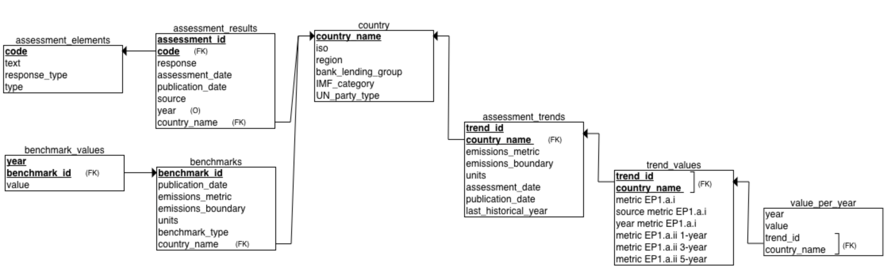

# SQL Database Justification 

This section is the justification and explanation of the ASCOR and TPI databases. ChatGBT was used to enhance writing in this report, it did not come up with ideas but helped me improve my writing. I wrote detailed bullet points of ideas for each sections/simple paragraphs and had chatgbt fix grammer and flow of ideas.

## ASCOR_API Database 

The **ascor_api** database is used to store the files from the *data/TPI_ASCOR_data_13012025* folder in the *TPI_API* repository. 

### ERD Diagram

#### Relationships Constraints

Here in the modelling stage, I chose to use optional relationships in cases where the presence of related data could not be guaranteed. For example, not every country in the ASCOR dataset currently has benchmark or trend. By allowing these relationships to be optional, the schema remains flexible which is important for future data expansion, allowing countries to be incrementally updated as more information becomes available.

***HAS_BENCHMARK:*** Each country can optionally have benchmark and each country cna have many benchmarks. Each benchmark must be connect to one country maximum. 

***HAS_VALUE:*** Each benchmark value (this is a pair of value and year) is linked to exactly one benchmark. Each benchmark can optionally have a benchmark value (this accounts for missing data) and can also have many benchmark values, most countries have years 2023-2030.

***HAS_ASSESSMENT:*** Each assessment is linked to exactly one country and each country can optionally have an assessment (avoiding rigid schema assumptions here) and can have maximum one assessment according to the file.

***RESULT_HAS_ELEMENT:*** Each assessment result (e.g metric) has exactly one assessment element (e.g. EP.1.a.i). Each assessment element can have multiple assessment results, for example the assessment element EP.1.a.i is used many times for each country.

***HAS_TRENDS:*** Each country can optionally have trends recorded and can also have multiple trends recorded, such as for different emmissions metrics. Each trend recorded is linked to exactly one country.

***TREND_HAS_VALUE:*** Each trend often has multiple values and each trend value must be linked to exactly one assessment trend.

***VALUES_PER_YEAR:*** Each trend value has multiple values per year, recorded from 2005 to 2030 for most countries. Each trend value pair (such as 29.88 for 2007) musyt be linked to exactly one trend value.

### Relational Schema 

### Overview of Structure and Design Choices

The following is an overview of the design choices made in response the the ASCOR data structure to ensure completeness, normalization, extensibility and a future proofed design.

First, **all non primary and foriegn key attributes were made nullable** as the ASCOR data files contains frequent missing entries (e.g., countries with partial trend data, missing source URLs). Allowing null values for all attributes was important as it meant partial values for some country assessments would not prevent this row being added to the database. This is especially important for a strong future-proof foundation to ensure all new data gets added to the database despite missingness.

Second, the **'No data' values in rows were turned into NULL values** so that the columns could be normalised into the correct data type. For example, the column *metric_ep1_a_i* in the ASCOR trends file held integer values, however the 'No data' entries prevented this being treated as the correct data type. 

Third, **primary and foreign keys were chosen based on identifiers that were consistently present** across files and are unlikely to change in future data releases, making them ideal anchors for long-term consistency. Such as benchmark_id, assessment_id, and country_name.

Fourth, in consideration of future data, the **schema avoids rigid design choices**. For example, assessment_elements allows for the addition of new assessment codes; value_per_year supports emissions trajectories through 2030 and beyond; trend_values can be expanded with new metrics as ASCOR's methodology evolves.

### Future-Proofing Considerations 

### Relationships 

### Entities and Attributes 

#### benchmarks

##### benchmark_values

To accurately model this one-to-many relationship — where each benchmark can have one value per year — you need a composite primary key on (benchmark_id, year):

#### country 

#### assessment_results 

#### assessment_elements

#### assessment_trends 

##### trend_values 

##### values_per_year

