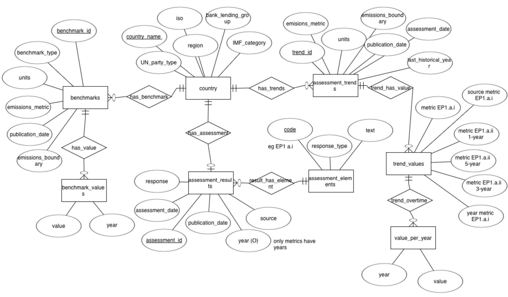
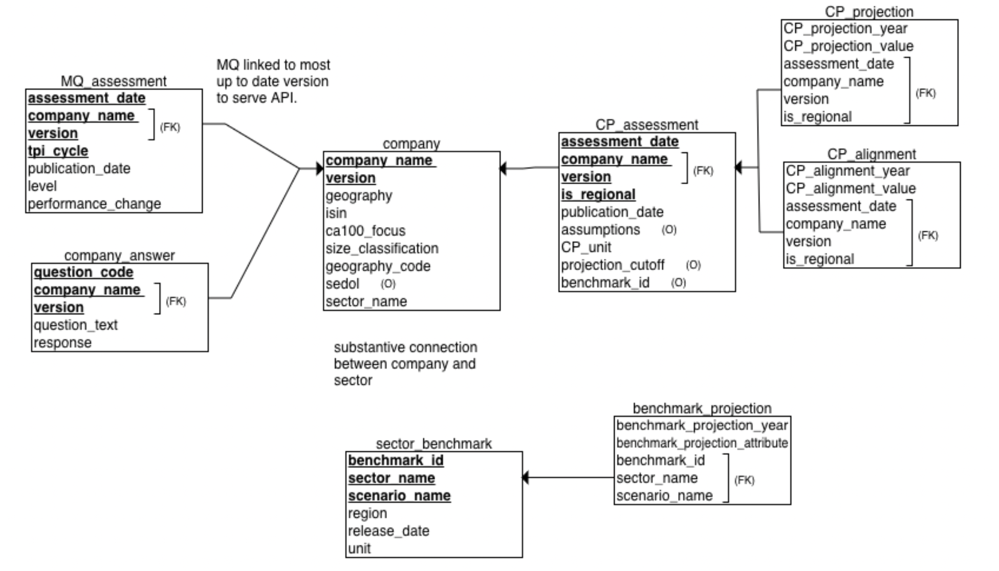

# SQL Database Justification 

This section is the justification and explanation of the ASCOR and TPI databases. ChatGBT was used to enhance writing in this report, it did not come up with ideas but helped me improve my writing. I wrote detailed bullet points of ideas for each sections/simple paragraphs and had chatgbt fix grammer and flow of ideas.

# Future-Proofing Considerations when Modelling Databases

A core pillar of the data architecture across both the ASCOR and TPI databases was the intentional design for future extensibility. Every design decision was guided by considering future data expansion. The following strategies were implemented across the **ASCOR** and **TPI** databases to promote future data expansion. 

1. After inspecting the data files, we noticed that flat files often stored data in wide format (e.g., one column per year or per question). Rather than hardcoding these into rigid table columns, such structures were **normalized into long format**. This decision was made in: benchmark_values, value_per_year, cp_projection, and cp_alignment
Where each row represents a (year, value) pair or (year, alignment) pair. This is really important as it means adding new years requires no schema changes and the API  can retrieve dynamic time series data without querying changing column names.

2. In the TPI datasets, company assessments exist across multiple research cycles (e.g., MQ cycle 1–5) and assessment versions (e.g., v4.0, v5.0). Therefore, the **database tracks company version** explicitly via a composite key and uses the latest version to link to the other tables. Currently, as 5.0 is the most recent version, all the entities are linked on this to serve the API with the most up to date information. This is important for the future as outdated versions are still stored, but not used to serve the API. 

3. In both databases, each type of assessment, such as metric or company questionnare answers are **stored in their own logically isolated table**. This means new questions or codes used to assess countries or companies can be added easily, such as new ASCOR codes like EP.1.a.i. 

4. After inspecting the datasets we realised there was a lot of missing data. Therefore, **all non-key attributes were made nullable**, allowing incomplete rows of data to still be stored. This prevents data loss and ensures that as countries or companies disclose more information in future, their records can be incrementally updated without full overwrites.

## ASCOR_API Database 

The **ascor_api** database is used to store the files from the *data/TPI_ASCOR_data_13012025* folder in the *TPI_API* repository. 

### ERD Diagram



#### Relationships Constraints

Here in the modelling stage, I chose to use optional relationships in cases where the presence of related data could not be guaranteed. For example, not every country in the ASCOR dataset currently has benchmark or trend. By allowing these relationships to be optional, the schema remains flexible which is important for future data expansion, allowing countries to be incrementally updated as more information becomes available.

***HAS_BENCHMARK:*** Each country can optionally have benchmark and each country cna have many benchmarks. Each benchmark must be connect to one country maximum. 

***HAS_VALUE:*** Each benchmark value (this is a pair of value and year) is linked to exactly one benchmark. Each benchmark can optionally have a benchmark value (this accounts for missing data) and can also have many benchmark values, most countries have years 2023-2030.

***HAS_ASSESSMENT:*** Each assessment is linked to exactly one country and each country can optionally have an assessment (avoiding rigid schema assumptions here) and can have maximum one assessment according to the file.

***RESULT_HAS_ELEMENT:*** Each assessment result (e.g metric) has exactly one assessment element (e.g. EP.1.a.i). Each assessment element can have multiple assessment results, for example the assessment element EP.1.a.i is used many times for each country.

***HAS_TRENDS:*** Each country can optionally have trends recorded and can also have multiple trends recorded, such as for different emmissions metrics. Each trend recorded is linked to exactly one country.

***TREND_HAS_VALUE:*** Each trend often has multiple values and each trend value must be linked to exactly one assessment trend.

***VALUES_PER_YEAR:*** Each trend value has multiple values per year, recorded from 2005 to 2030 for most countries. Each trend value pair (such as 29.88 for 2007) musyt be linked to exactly one trend value.

### Relational Schema 


### Overview of Structure and Design Choices

The following is an overview of the design choices made in response the the ASCOR data structure to ensure completeness, normalization, extensibility and a future proofed design.

First, **all non primary and foriegn key attributes were made nullable** as the ASCOR data files contains frequent missing entries (e.g., countries with partial trend data, missing source URLs). Allowing null values for all attributes was important as it meant partial values for some country assessments would not prevent this row being added to the database. This is especially important for a strong future-proof foundation to ensure all new data gets added to the database despite missingness.

Second, the **'No data' values in rows were turned into NULL values** so that the columns could be normalised into the correct data type. For example, the column *metric_ep1_a_i* in the ASCOR trends file held integer values, however the 'No data' entries prevented this being treated as the correct data type. 

Third, **primary and foreign keys were chosen based on identifiers that were consistently present** across files and are unlikely to change in future data releases, making them ideal anchors for long-term consistency. Such as benchmark_id, assessment_id, and country_name.

Fourth, in consideration of future data, the **schema avoids rigid design choices**. For example, assessment_elements allows for the addition of new assessment codes; value_per_year supports emissions trajectories through 2030 and beyond; trend_values can be expanded with new metrics as ASCOR's methodology evolves.


### Entities and Attributes 

#### Benchmarks

This entity stores data from the **ASCOR_benchmarks.xlsx** file. This file uses the id column in the excel file as the PK as this is unique for every country and country could not be used as there was multiple benchmarks for each country. All attributes are nullable to ensure that missing data does not prevent data being added. The logic for the initial benchmark entity is straightforward, as the attributes directly link to the names of the columns in the files and each country can have multiple benchmarks, uniquely defined by a combination of benchmark_id and country_name.

**Data types:**
```
benchmark_id         INT NOT NULL (PK)  
publication_date     DATE 
emissions_metric     VARCHAR 
emissions_boundary   VARCHAR 
units                VARCHAR
benchmark_type       VARCHAR 
country_name         VARCHAR NOT NULL (FK to country.country_name)  
```

**Example benchmark entity:**
```
benchmark_id         96  
country_name         Angola  
publication_date     2024-11-01  
emissions_metric     Absolute  
emissions_boundary   Production - excluding LULUCF  
units                MtCO₂e  
benchmark_type       National 1.5C benchmark  
```

##### benchmark_values

This entity holds the year/value pairs for each country benchmark. Instead of using a wide format, where the benchmarks table would include separate columns for each year (e.g., 2023, 2024, ..., 2030), a separate normalized table (benchmark_values) is used. This is advantageous because: 
- It supports flexibility as future years can be added without altering the table schema.
- It also avoids sparse data as  years with no values aren't stored as empty columns.
- It maintains relational integrity and reduces redundancy by linking to the benchmarks table.

Moreover, to accurately model this one-to-many relationship, where each benchmark can have one value per year, the benchmark_values table uses a composite primary key on (benchmark_id, year).

The year attribute is derived from the column name in the original Excel file and must not be null, as it's logically impossible for a benchmark value to lack a corresponding year. Moreover, the value must also not be null.

**Data Types:**
```
benchmark_id         INT NOT NULL (PK part, FK to benchmarks.benchmark_id)  
year                 INT NOT NULL (PK part)  
value                FLOAT NOT NULL  
```

**Example Entry:**
```
benchmark_id         96
year                 2025
value                20.09  
```
#### country 

The country entities are used to store data in the **ASCOR_countries.xlsx** file. Here, each country has one entry, therefore country was used as the PK. An alternative approach would have been to create a composite primary key between the country name and the id (first column), however, after further inspection of the data I realised these ids were not consistent across file. Therefore, introducing id as a composite primary key would have been inefficient for joining tables together, given the ids across files for countries do not match up. 

Once again, all attributes can be null, apart from the PK, to ensure missing data does not result in country not being added to the dataset.

**Data Types:**
```
country_name         VARCHAR NOT NULL (PK)  
iso                  VARCHAR  
region               VARCHAR
bank_lending_group   VARCHAR 
IMF_category         VARCHAR 
UN_party_type        VARCHAR 
```
**Example county entity:**
```
country_name         Angola  
iso                  AGO  
region               Sub-Saharan Africa  
bank_lending_group   Lower-middle-income  
IMF_category         Emerging market economies  
UN_party_type        Non-Annex I and Non-Annex II  
```

#### assessment_results 

This entity stores data from the **ASCOR_assessments_results.xlsx** file. Each row in this file represents one response to one element (e.g EP.1.a or r EP.2.d) by one country, and is uniquely identified by a composite primary key of (assessment_id, code). Here the code refers the the response element and further information on each code can be found by joining this entity with assessment_elements based on the code. The assessment_id is a unique identifier for each full country assessment. However, because one assessment includes multiple element responses (each tagged by a code), a composite key is necessary. 

How **Source** and **Year** are extracted:
- In the original Excel file, each column contains year and response in the following structure *year indicator EP.1.a* and *source indicator EP.1.a*
- The year is extracted from the respective year XXX column (e.g., year indicator EP.1.a) only if present and not null.
- The source is taken from the matching source XXX column (e.g., source indicator EP.1.a) if available.

This structure allows the model to support:

- Multiple assessments per country (over time).
- Multiple responses per assessment.
- Linkage to both the indicator and country context via foreign keys.
- The year and source fields are optional but included when available, to give further metadata about the timing and provenance of the response.

Once again, null values are permitted in non-key attributes to allow for incomplete submissions or ongoing data collection.

**Data Types:**
```
assessment_id        INT NOT NULL (PK part)  
code                 VARCHAR NOT NULL (PK part, FK to assessment_elements.code)  
country_name         VARCHAR NOT NULL (FK to country.country_name)  
response             VARCHAR  
assessment_date      DATE  
publication_date     DATE  
source               VARCHAR  
year                 INT  
```

**Entry Example:**
```
assessment_id        235  
code                 EP.1.a  
country_name         Angola  
response             Yes  
assessment_date      2024-10-15  
publication_date     2024-12-01  
source               https://1p5ndc-pathways.climateanalytics.org/
year                 2023  
```
#### assessment_elements

This entity stores metadata from the **ASCOR_indicators.xlsx file**, defining each individual indicator, area, or metric used in ASCOR assessments. Each entry corresponds to a unique assessment element and is identified by a code, such as EP.1.a, which acts as the primary key. This table serves as a reference for interpreting codes in the assessment_results entity and enables consistent definitions for each element used across assessments. This also means future codes can be easily added in the future. 

**Data Types:**
```
code                 VARCHAR NOT NULL (PK)  
text                 VARCHAR 
response_type        VARCHAR 
type                 VARCHAR 
```

**Example assessment_elements entity:**
```
code                 EP.1.a  
text                 Has the country improved its emissions profile over the past 5 years?
response_type        Yes/No  
type                 indicator  
```

### Assessment Trends 

The Excel file **ASCOR_assessments_results_trends_pathways.xlsx** contains a mix of structurally different data types:  trend metadata, single-value metrics, and yearly time series projections. These are all stored into a single flat file. Following the best practices in relational database design (especially normalization and separation of concerns), the data was split into three distinct but related entities described below.

#### assessment_trends 

This entity stores data from the **ASCOR_assessments_results_trends_pathways.xlsx** file. This table stores general metadata about each emissions trend and each record corresponds to one emissions trend assessment (row in the file). A composite primary key on (trend_id, country_name) is used because the id column alone is reused across countries and their are multiple rows for each country. 

**Data Type:**
```
trend_id             INT NOT NULL (PK part)  
country_name         VARCHAR NOT NULL (PK part, FK to country.country_name)  
emissions_metric     VARCHAR  
emissions_boundary   VARCHAR  
units                VARCHAR  
assessment_date      DATE  
publication_date     DATE  
last_historical_year INT  
```
**Example Entry:**
```
trend_id             291  
country_name         Australia  
emissions_metric     Intensity per GDP-PPP  
emissions_boundary   Production - excluding LULUCF  
units                tCO₂e/Million US$  
assessment_date      2023-10-31  
publication_date     2023-12-01  
last_historical_year 2022  
```

##### trend_values 

This entity stores specific metrics and performance change summaries of the assessment trends.

To organize this data:

- Metric values such as metric_ep1.a.i are cleaned (e.g., converting "No data" to NULL).
- Change values (e.g., metric_ep1.a.ii_1-year) originally included percent signs or the string "Not applicable" and are cleaned into a consistent format (as strings or nulls).

The same composite key (trend_id, country_name) is used, and a foreign key constraint links it to assessment_trends.

**Data Types:**
```
trend_id                 INT NOT NULL (PK part, FK to assessment_trends.trend_id)  
country_name             VARCHAR NOT NULL (PK part, FK to assessment_trends.country_name)  
metric_ep1_a_i           FLOAT  
source_metric_ep1_a_i    VARCHAR  
year_metric_ep1_a_i      INT  
metric_ep1_a_ii_1_year   VARCHAR  
metric_ep1_a_ii_3_year   VARCHAR  
metric_ep1_a_ii_5_year   VARCHAR  
```

**Example Entry:**
```
trend_id                 291  
country_name             Australia  
metric_ep1_a_i           328.04  
source_metric_ep1_a_i    NULL  
year_metric_ep1_a_i      NULL  
metric_ep1_a_ii_1_year   -11.20  
metric_ep1_a_ii_3_year   -8.20  
metric_ep1_a_ii_5_year   -7.00  
```

##### values_per_year

This entity stores the projected emissions values for each year for each country and trend. In the raw Excel data, these values were stored as separate columns for each year, in a wide format, but to improve flexibility and reduce redundancy, these columns are normalized into a long format. This normalization allows easy updates as future years are added and cleaner handling of missing data as missing data not stored.

The foreign key (trend_id, country_name) references the trend_values table to maintain relational consistency.

**Data Types:**
```
year                    INT NOT NULL  
value                   FLOAT NOT NULL  
trend_id                INT NOT NULL (FK to trend_values.trend_id)  
country_name            VARCHAR NOT NULL (FK to trend_values.country_name)  
```

**Example Entry:**
```
year        2005  
value       805.91  
trend_id    291  
country_name Australia  
```


## TPI_API Database 


### ERD Diagram


#### Relationships Constraints

***has_MQ_assessment:***  Each company can optionally have an MQ assessment or it can have multiple depending on the research cycle, as there are 5 MQ files in the TPI data folder. Each MQ assessment must be linked to exactly one company.

***has_CP_assessment:*** Each company can optionally have an CP assessment or it can have multiple (this accounts for future CP assessments). Each CP assessment must be linked to exactly one company. 

***has_projection:***  Each CP assessment can optionally have a projection or it can have many (most likely) as there are columns 2013-2050 in the file. Each projection must be linked to exactly one CP assessment.

***has_alignment:*** Each CP assessment can optionally have a alignment (missing data) or it can have many (most likely) as there are columns Carbon Performance Alignment 2035 and Carbon Performance Alignment 2050 etc. in the file. Each alignment must be linked to exactly one CP assessment.

***answers_questions:***  Each company can optionally answer a question or answer multiple, but each question must be linked to exactly one company.

***sector_has_projection:***   Each sector can optionally have a projection (this accounts for missing data) or can have many, specifically years 2013-2050 in the file. Each sector must be linked to exactly one sector.


### Relational Schema 



### Overview of TPI Structure and Design Choices

The following is an overview of the major design decisions made when building the TPI database schema. 

Most importantly, the **schema are linked on the most recent version of *Company lastest assessment files***. In the TPI file there are two different versions of company assessments, 4.0 and 5.0. Therefore, companies are stored with a version field (e.g., 4.0 or 5.0), and all dependent tables (e.g., company_answer, mq_assessment, cp_assessment) use composite primary keys that include both company_name and version. Currently, as 5.0 is the most recent version, all the entities are linked on this to serve the API with the most up to date information. This is important for the future as outdated versions are still stored, but not used to serve the API. 

Secondly, **company and sector are not linked**. Although both the company and sector benchmark datasets contain a "sector" field, they cannot be directly linked due to a mismatch in how sector names are defined. For example, 13 sectors in the company dataset (e.g., Telecommunications, Oil & Gas Distribution, Consumer Services) do not exist in the sector benchmark data. Moreover, even for those that match, the benchmark file contains multiple entries for the same sector. So even when a company is listed in the Airlines sector, it's unclear which of the many benchmark rows it should be linked to. 

### Entities and Attributes 

#### company

This entity stores metadata about each assessed company from the **Company_Latest_Assessments_4.0.csv** and **Company_Latest_Assessments_5.0.csv** files. Each company version is included as an attribute, which is derived from the file names A composite primary key of company_name and version is used to identify each company in a specific assessment cycle.

As noted in the previous section, the *sector_name* field here is not linkable to the sector benchmark data, since it contains non-standard labels like Basic Materials or Technology that do not correspond to benchmark sectors.

The same as the ASCOR dataset, all non-key attributes are nullable to allow for partial submissions or missing metadata.

**Data Types:**
```
company_name         VARCHAR NOT NULL (PK part)  
version              VARCHAR NOT NULL (PK part)  
geography            VARCHAR  
isin                 VARCHAR  
ca100_focus          VARCHAR  
size_classification  VARCHAR  
geography_code       VARCHAR  
sedol                VARCHAR  
sector_name          VARCHAR  
```

**Example Entities:**
```
company_name         Shell plc  
version              5.0  
geography            United Kingdom  
isin                 GB00B03MLX29  
ca100_focus          Yes  
size_classification  Large  
geography_code       GBR  
sedol                B03MLX2  
sector_name          Oil & Gas (Other)  
```


#### sector_benchmark

This entity stores emissions benchmarks from the **Sector_Benchmarks_08032025.csv file**. These benchmarks define emissions intensity or absolute targets under different climate scenarios (e.g., Below 2 Degrees, Net Zero 2050).

The composite key (benchmark_id, sector_name, scenario_name) uniquely identifies each benchmark. This allows the schema to distinguish between multiple benchmarks for the same sector depending on the scenario and region.

**Data Types:**
```
benchmark_id         VARCHAR NOT NULL (PK part)  
sector_name          VARCHAR NOT NULL (PK part)  
scenario_name        VARCHAR NOT NULL (PK part)  
region               VARCHAR   
release_date         DATE   
unit                 VARCHAR
```

**Example Entity:**
```
benchmark_id         B2025  
sector_name          Cement  
scenario_name        Net Zero 2050  
region               Global  
release_date         2025-03-08  
unit                 tCO₂e/tonne  
```

#### benchmark_projections 

This entity stores yearly emissions benchmarks for each sector-scenario combination. The raw Excel format contained one column per year (2013–2050) so these were normalized into a long format with one row per year per benchmark. Moreover, each projection is linked back to its parent benchmark via a foreign key on (benchmark_id, sector_name, scenario_name). This makes it easy if more years are added in the future.


**Data Types:**
```
benchmark_projection_year        INT 
benchmark_projection_attribute   FLOAT  
benchmark_id                     VARCHAR NOT NULL (FK part)  
sector_name                      VARCHAR NOT NULL (FK part)  
scenario_name                    VARCHAR NOT NULL (FK part)  

```

**Example Entity:**
```
benchmark_projection_year        2025  
benchmark_projection_attribute   0.89  
benchmark_id                     B2025  
sector_name                      Cement  
scenario_name                    Net Zero 2050  
```


#### company_answers

This entity stores responses to TPI’s questionnaire for each company and assessment cycle from the files **Company_Latest_Assessments_4.0.csv** and **Company_Latest_Assessments_5.0.csv**.

In these files, each question appears as a separate column, where the header combines a unique question code and descriptive text in the following format *Q4L2 | Has the company set greenhouse gas emission reduction targets?*.

**To convert this into a normalized database structure the following steps are taken:**
1. Each column starting with "Q" and containing a "|" is interpreted as a question.
2. The question code and question text are extracted by splitting on the pipe character.
3. For every company, each response is transformed into a single row with its associated code, text, and version.
4. Responses that were empty or missing were excluded to maintain integrity under the NOT NULL constraint.

Rather than embedding all 14+ questions directly in the company table, having a seperate table for company answers avoids schema rigidity as new questions are introduced and reduces sparsity. The structure uses a composite primary key of (question_code, company_name, version) to uniquely identify each response and ensure consistency with the versioned company table via foreign key constraints.

**Data Types:**
```
question_code       VARCHAR NOT NULL (PK part)  
question_text       VARCHAR NOT NULL  
response            VARCHAR NOT NULL  
company_name        VARCHAR NOT NULL (FK part)  
version             VARCHAR NOT NULL (FK part)  

```

**Example Entity:**
```
question_code        Q4L2  
question_text        Has the company set greenhouse gas emission reduction targets?  
response             No  
company_name         Yankuang Energy  
version              4.0  
```


#### MQ_assessments

This entity stored the MQ assessment data from the *** MQ_Assessments_Methodology_<n>_....csv***, where <n> represents the TPI research cycle. Each cycle corresponds to a specific window of assessment activity e.g. cycle 1 assessments in 2015–2017 and were published 2017–2018. Here, the **tpi_cycle**  attribute is extracted directly from the filename. For example:

- MQ_Assessments_Methodology_1_...csv → tpi_cycle = 1
- MQ_Assessments_Methodology_4_...csv → tpi_cycle = 4 

Each MQ assessment entry is joined to the latest version of the company (based on a subquery), ensuring the record links to the correct company_name and version.

**Data Types:**
```
assessment_date      DATE NOT NULL (PK part)  
publication_date     DATE  
level                INT  
performance_change   VARCHAR  
tpi_cycle            INT NOT NULL (PK part)  
company_name         VARCHAR NOT NULL (PK part, FK to company.company_name)  
version              VARCHAR NOT NULL (PK part, FK to company.version)  
```

**Example Entity:**
```
assessment_date       2017-01-10  
publication_date      2017-07-01  
level                 1  
performance_change    new  
tpi_cycle             1  
company_name          Yankuang Energy  
version               4.0  
```


#### CP_assessment 

This entity stores CP assessment data from **CP_Assessments_08032025.csv**, which is global assessments, and **CP_Assessments_Regional_08032025.csv**, which is for regional assessments.

The attributed **is_regional** is introduced to distinguish the two datasets (0 = global, 1 = regional), meaning that regional and global assessments  can be distinguished while still using one unified schema. A composite primary key of (assessment_date, is_regional, company_name, version) is used to uniquely identify each assessment event per company and context.

**Data Types:**
```
assessment_date       DATE NOT NULL (PK part)  
publication_date      DATE  
assumptions           VARCHAR  
cp_unit               VARCHAR  
projection_cutoff     DATE  
benchmark_id          VARCHAR  
is_regional           VARCHAR NOT NULL (PK part)  
company_name          VARCHAR NOT NULL (PK part)  
version               VARCHAR NOT NULL (PK part)  
```

**Example Entity:**
```
assessment_date       2023-10-15  
publication_date      2023-12-01  
assumptions           IEA Net Zero by 2050 scenario  
cp_unit               tCO₂e/MWh  
projection_cutoff     2022-12-31  
benchmark_id          B2025  
is_regional           0  
company_name          Shell plc  
version               5.0  

```

#### CP_projection

This entity contains the emissions projection values for the CP assessments. In the original files, these projections were stored with one column per year (e.g., 2022, 2023, ..., 2050). Similar to **values_per_year** in the ASCOR database, to improve flexibility and reduce redundancy, these columns are normalized into a long format.

The year attribute is derived from the column name in the original Excel file and must not be null and the value must also not be null. 

**Data Types:**
```
cp_projection_year      INT NOT NULL  
cp_projection_value     INT NOT NULL  
assessment_date         DATE NOT NULL (FK part)  
company_name            VARCHAR NOT NULL (FK part)  
version                 VARCHAR NOT NULL (FK part)  
is_regional             VARCHAR NOT NULL (FK part)  

```

**Example Entity:**
```
cp_projection_year      2025  
cp_projection_value     183  
assessment_date         2023-10-15  
company_name            Shell plc  
version                 5.0  
is_regional             0  
```

#### CP_alignment 

This entity stores  alignment scores from the CP assessments. In the raw files, each column is titled in the format: *Carbon Performance Alignment 2025, ... 2030, ... 2050, etc*.

**To normalize this:**
1. All columns that start with "Carbon Performance Alignment " are selected.
2. The target year is extracted by parsing the final part of the column name (e.g., "2030" from "Carbon Performance Alignment 2030").
3. For each row (i.e., each company assessment), the value under that column is treated as the alignment result (e.g., "Aligned", "Not Aligned", "No Disclosure").
4. Each year/value pair becomes a new row in the cp_alignment table, along with company metadata (name, version, assessment date, and regional/global flag).
5. Any rows with null or missing alignment values are excluded, ensuring the table only stores meaningful entries.

Storing this alignment data in a seperate table allows for flexiable querying and future proofing if new years are added


**Data Types:**
```
cp_alignment_year      INT NOT NULL  
cp_alignment_value     VARCHAR NOT NULL  
assessment_date        DATE NOT NULL (FK part)  
company_name           VARCHAR NOT NULL (FK part)  
version                VARCHAR NOT NULL (FK part)  
is_regional            VARCHAR NOT NULL (FK part)  

```

**Example Entity:**
```
cp_alignment_year      2030  
cp_alignment_value     Not Aligned  
assessment_date        2023-10-15  
company_name           Shell plc  
version                5.0  
is_regional            0  

```
