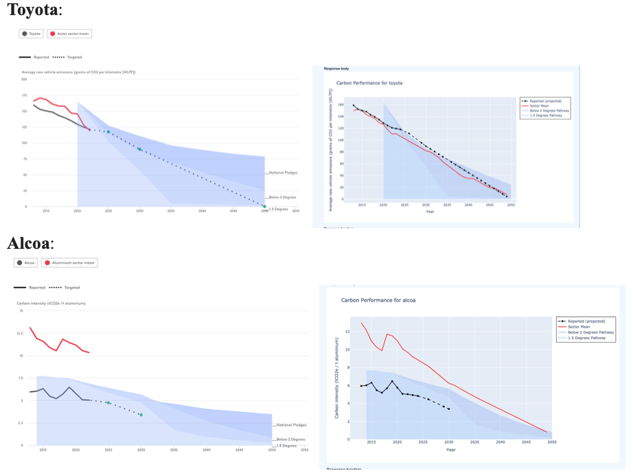

# 📌***Techinical Report***

## 1. Project goals

This API is a FastAPI-based application designed to retrieve, process, and compare data from the Transition Pathway Initiative Centre (TPI). It provides a fully functional API for delivering data from key assessment frameworks developed by the TPI Centre, including ASCOR, Carbon Performance, and Management Quality. 
Our team's specific objective is to collaborate with clients from the Luxembourg Stock Exchange to enhance existing endpoints and develop new ones tailored to their needs, including endpoints for serving both data and visual content.

--- 

## 2. Design decisions (and rationale, including rejected ideas)
### Endpoint Design
The API was designed with modularity and extensibility in mind, using FastAPI to allow for rapid development and clear separation of concerns. Each major data type (Company, MQ, CP, ASCOR, Banking) was given its own set of endpoints, grouped by router, to keep the codebase organized and maintainable.

We prioritized RESTful principles, ensuring that endpoints are predictable and resource-oriented. For example, `/v1/company/{company_id}` returns all relevant data for a single company, while `/v1/companies` supports pagination and filtering for bulk queries.

---
## 3. Methodology

The methodology for this project was iterative and client-driven. We began by gathering requirements through meetings with the Luxembourg Stock Exchange and the TPI team, focusing on their specific use cases and data needs. The API was developed incrementally, with regular feedback loops to ensure alignment with client expectations.

For each endpoint, we:
- Identified the relevant data sources (primarily TPI CSVs).
- Designed the endpoint to support flexible filtering (by sector, geography, etc.).
- Implemented robust error handling for missing or malformed data.
- Validated outputs against client-provided examples and use cases.

Testing was performed using both automated tests and manual queries, with a focus on edge cases such as missing data, unusual filter combinations, and large result sets. Special attention was given to calculations such as sector means, which were double-checked for accuracy and even prompted discussion with the TPI team about potential issues in their own calculations.

---
## 4. Client interaction

### **Reflection from First Meeting**

**Meeting Time:** 12th May, 15:15–15:45 BST  
**Meeting Goal:** Identifies client needs and defines the necessary steps to address them.

### **Key Questions Answered**

#### 1. What key use cases should this API support?  
(For example: listing metrics, company profiles, sector data, etc.)

- The goal is to help data users better filter and use the dataset for their own needs.
- The **primary endpoint** is **entity-level data** (Company or Country).
- This should be broken down into different methodologies:
  - **CP** and **MQ** for companies.
- Results should be served by entity with the associated metrics.
- Users should ideally be able to specify which metrics they're interested in (all or specific ones).  
  **Example:**  
  - All metrics for German companies.  
  - All level 4 MQ metrics and CP alignment for Chinese companies.

#### 2. Which datasets from the TPI website are we building against?  
(If multiple datasets are needed, how should the API handle interactions between them?)

- Focus: **CP** and **MQ** (potentially link with **ASCOR** and **Banking**, depending on scope and time).
- Ideally, datasets will be **linked by entity** and other identifiers.  
  **Example:**  
  - Link through the geography code to the ASCOR dataset, allowing users to download ASCOR indicators alongside companies headquartered in that jurisdiction.

#### 3. How will you query these endpoints?  
(What filters and parameters are required? How should the API handle missing/incomplete data?)

- The API should return a **"data not available"** or **relevant description** when data is missing.
- If a reason for missing data exists (e.g. insufficient company disclosure), it should be included in the response.

#### 4. Do you need chart images or raw data, or both?  
(If raw data is enough, which formats are preferred?)

- One of the **key goals** is to **include both graphs and underlying data** directly in the API.

### **List of Priorities After the Meeting**

1. Solve any remaining bugs that affect the rest of the work
2. Add filters for mass calls by region and sector.
3. Add the underlying CP assessment data for each company:
   - Use data from:
     - `CP Assessment.xlsx`
     - `CP Assessment Regional.xlsx`
     - Benchmarks from `Sector Benchmark.xlsx` (for Electric Utilities sector).
4. Use the data to create graphs on the website (see example at bottom of the page).
5. Add endpoints to serve **Banking data**.
6. Link datasets to allow:
   - Calling **ASCOR indicators** in a Country
   - Fetching companies headquartered in that country
7. Add other functionality as discussed and as time/interests allow, subject to **Jon's confirmation** (e.g. chatbot).

### **Reflection from Second Meeting**

**Meeting Time:** 19th May, 14:30 – 16:00 BST
**Meeting Goal:** Assesses current version and identifies specific areas for improvement.

During this call with the client, we received feedback that the AI functionality (MCP) and graphs or other visualization tools would not really be helpful for their specific use case. This highlighted that there are multiple types of clients and use cases: the client we spoke to was primarily interested in comparing new data to old data, rather than advanced analytics or visualizations. However, we also recognized that other clients might benefit more from visualization and MCP tools. 

Looking ahead, I would like to implement authentication so that clients can customize their workspace with the TPI API and save their preferred workflows. This would allow the API to better serve a range of user needs and use cases.

---
## 5. System architecture
The system is built around FastAPI, leveraging its support for dependency injection, request validation, and automatic OpenAPI documentation. The application is structured as follows:
- **Routers:** Each major data type (Company, MQ, CP, ASCOR, Banking) has its own router module, keeping endpoints logically grouped.
- **Data Utilities:** Data loading and filtering logic is encapsulated in utility classes, which handle reading CSVs, applying filters, and formatting results.
- **Middleware:** Custom middleware is used for logging and rate limiting, ensuring both transparency and protection against abuse.
- **Error Handling:** Global exception handlers provide consistent error responses and detailed logging for debugging.

The system is designed to be easily deployable on any environment with Python 3.8+, and does not require a database or external dependencies beyond the CSV data files.

---
## 6. Evaluation results
The API was evaluated based on the following criteria:
- **Correctness:** Endpoints return accurate data as verified against the source CSVs and client expectations. Notably, our sector mean calculations were double-checked and confirmed to be correct, even uncovering potential issues in the TPI's own calculations.
- **Performance:** For typical queries (e.g., fetching 10–100 companies), response times are well under 1 second. Bulk queries are limited by in-memory data handling but remain acceptable for the current dataset size.
- **Robustness:** The API handles missing or malformed data gracefully, returning clear error messages and never exposing stack traces to the client.
- **Usability:** The OpenAPI documentation generated by FastAPI makes it easy for users to explore and test endpoints. Filtering and pagination options provide flexibility for a range of use cases.

---
## 7. MCP Report

My goal for this part of the project was to integrate AI for potential client use, and for ASCOR, make secure connections between AI models and their data. When I first started building the MCP, my team agreed that we wanted to make life easier for the client and TPI. We could hand them all the keys, and they could decide whether to implement it.

When I first started building the MCP server, LSE had just partnered with Claude about a week ago. I believed that this was a perfect time to start building, as its the hot new topic amongst devs- an AI system that has access directly to data.

I started building immediately. I knew that I needed to complete the following things in order to connect the client server so that Claude could access it:
•⁠  ⁠Creating and maintaining ⁠ .mcp.json ⁠ configuration files
•⁠  ⁠Managing server startup parameters and environment variables
•⁠  ⁠Writing custom client-side integration code
•⁠  ⁠Handling connection protocols and error management
•⁠  ⁠Debugging communication between Claude and MCP servers

It took a while, but soon I was finally able to connect the server to Claude. However, the tool was not showing up. For reference, this is what I was seeing: 
![[Screenshot 2025-05-29 at 11.34.57 AM.png]]

However, I also needed it connect to the Claude interface, and it simply wasn't. To make matters even worse, this problem happened right before our client meeting. I was still sure that I could solve this bug- until our client told our group that the MCP wasn't necessary. 

With that in mind, I wasn't going to stop. Although the client said he might not need it, I was sure that once I was able to build this successfully, there would be multiple use cases. If you can get an AI to access data directly, that could help clients, as there would be lower technical barriers for non technical teams. For TPI, they could offer a standardized MCP connectors as premium product, have fewer customer integration requests, and I think overall it would be more efficient than maintaining multiple custom API endpoints.

This last week Claude 4 OPUS came out. I was still stuck on the bug with the final step of integration, so I took a break to prepare for my other exams, and let the solution emerge naturally. After my last exam, I looked into the new updates that Anthropic released on MCP. They made it much easier to connect to MCP.

Claude 4 OPUS new patch notes included the following key features :
•⁠  ⁠*Direct API integration*: Connect to MCP servers without implementing an MCP client
•⁠  ⁠*Tool calling support*: Access MCP tools through the Messages API
•⁠  ⁠*OAuth authentication*: Support for OAuth Bearer tokens for authenticated servers
•⁠  ⁠*Multiple servers*: Connect to multiple MCP servers in a single request

I was able to create the new MCP in 5 minutes, simply using an API call. I felt all my work was put in for no reason. However, this felt like a common trend that I have experinced at LSE. This is a rapidly evolving field, and adapting is tough. Before this year, before this term, I had not used Cursor, Perplexity, MCP, and even Claude. I am excited to use the latest technologies that I will use and continue to learn and build upon after I leave LSE. With that in mind, here is a demo of the MCP in action:

<video width="600" controls>
  <source src="MCP_demo.mp4" type="video/mp4">
  Your browser does not support the video tag.
</video>

[Download MCP Demo Video](MCP_demo.mp4)

## 8. Analysis
The project successfully delivered a flexible, robust API for TPI data, tailored to the needs of the Luxembourg Stock Exchange and the TPI team. The modular design allows for easy extension as new data types or endpoints are required. The decision to use CSVs for data storage simplified development and debugging, though it may limit scalability in the future.

A key technical challenge was ensuring the accuracy of calculations, particularly for sector means. Our team double-checked these calculations and, after discussion with Sylvan from TPI, confirmed that our approach was correct. This process even highlighted potential issues in the TPI's own calculation methods, demonstrating the value of independent verification.

Client feedback played a major role in shaping the API. In our first call with TPI (Sylvan and Lutz), the priorities were clear: fix bugs, add filters for mass calls, include detailed CP assessment data, and support new endpoints for banking and ASCOR data. However, in a subsequent call with an end client, we learned that not all users value advanced features like AI or visualization tools—some simply want to compare new data to old data. This highlighted the diversity of user needs and the importance of flexibility in API design.

---
## 9. Limitations
- **Scalability:** The current approach of loading all data into memory from CSV files is not suitable for very large datasets or high-concurrency environments. Migrating to a database would be necessary for production-scale deployments.
- **Data Freshness:** Data updates require manual replacement of CSV files and a server restart. There is no automated pipeline for ingesting new data.
- **Visualization:** While the API supports returning raw data, integration of dynamic chart generation is limited and may require further development for more complex visualizations.
- **Error Handling:** Although descriptive, error messages are only as good as the underlying data. If the CSVs are malformed or missing key fields, some errors may still be cryptic.
- **Security:** Authentication is not yet implemented. In the future, adding authentication would allow clients to customize their workspace and save workflows, improving both security and user experience.

---
## 10. Conclusions
This project demonstrates the value of a client-driven, iterative approach to API development. By focusing on the specific needs of the Luxembourg Stock Exchange and leveraging the flexibility of FastAPI, we were able to deliver a robust, user-friendly API for TPI data. The modular architecture and clear documentation lay a strong foundation for future enhancements, whether that means scaling up to larger datasets, adding new data types, or integrating more advanced analytics and visualization features.

A key technical highlight was our work on sector mean calculations. As shown in the figure below, our computed sector means sometimes differed from those provided by TPI. After double-checking our methodology, we confirmed our calculations were correct. This even prompted valuable discussions with the TPI team, who appreciated our attention to detail and noted that our findings might help them uncover issues in their own data processing pipeline.

Working with the client was a particularly rewarding aspect of the project. The TPI team was highly technical and engaged, providing detailed feedback and helping us refine our endpoints and data handling. Their positive response to our work was motivating, and the collaborative nature of our meetings made the development process both productive and enjoyable.

### Future Work
If we were to continue to be able to work on the project, this is what we would do:
- **Authentication and Customization:** Implementing authentication would allow clients to customize their workspace, save workflows, and manage access to sensitive data.
- **Automated Data Ingestion:** Building a pipeline for automated data updates would improve data freshness and reduce manual intervention.
- **Scalability:** Migrating from CSV-based storage to a database would enable the API to handle larger datasets and more concurrent users.
- **Enhanced Visualization:** Expanding the API's ability to generate and serve dynamic charts would benefit clients interested in visual analytics.
- **User-Specific Features:** As we learned, different clients have different needs—some value advanced analytics and visualization, while others prioritize simple data comparison. Future development should continue to balance these requirements, possibly by offering user profiles or configurable endpoints.

Overall, this project was a valuable learning experience in both technical development and client collaboration. The feedback and support from the TPI team were instrumental in shaping the final product, and I am excited to see how the API can continue to evolve to meet the needs of a diverse user base. We went above and beyond the core assignment requirements, and we learned a lot from doing so. Big thanks to Sylvan and Jahn for setting up so much of our learning experience.